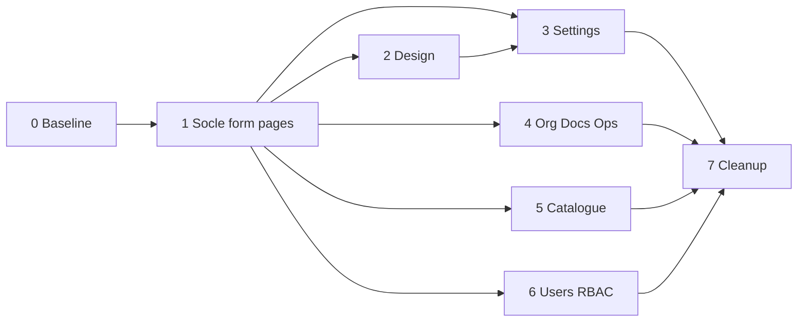

# Roadmap Admin Sinfinity

Feuille de route **actuelle** de la console d’administration Next.js (`apps/admin`, port **3001**), consommant l’API NestJS (`apps/api`, port **4000**).

Ce document **remplace** l’ancien plan phases 0–8 (fondations → dashboard), désormais considéré comme **baseline livrée**. Le travail restant porte sur :

1. un **socle de pages formulaire** plein écran ;
2. une **cohérence design** shell / listes / formulaires ;
3. la **migration** de tous les CRUD create/edit hors modales vers des routes dédiées ;
4. la **livraison** des stubs (utilisateurs, rôles, catégories catalogue) ;
5. le **nettoyage** des modales CRUD obsolètes.

**Format de travail** : une branche principale par phase, puis des branches secondaires parallélisables (idéalement une par agent / une par PR), chacune avec un **prompt copiable**.

---

## Périmètre Admin (oui / non)

| Oui — console d’administration | Non — réservé à Web (`:3000`) ou POS (`:3002`) |
|--------------------------------|--------------------------------------------------|
| Organisations, agences, utilisateurs, rôles | Pipeline CRM, devis, commandes, sourcing |
| Paramétrage global (devises, taxes, geo…) | Workflows opérationnels (import, stock, livraison) |
| Paramètres système, audit, journaux de connexion | Caisse / point de vente |
| Types documentaires, référentiels catalogue | Installation terrain, maintenance, facturation métier |

L’Admin **ne réimplémente pas** le métier : elle orchestre configuration et gouvernance sur l’API (voir [`apps/api/docs/ROADMAP.md`](../../api/docs/ROADMAP.md)).

**Multilingue** : **fr** (défaut), **en**, **es** — déjà en place via `next-intl` (cookie `sinfinity_locale`, pas de préfixe d’URL).

**Sources de vérité**

| Sujet | Fichier |
|-------|---------|
| Roadmap API | [`apps/api/docs/ROADMAP.md`](../../api/docs/ROADMAP.md) |
| DDL MySQL | [`database/sql/sinfinity_schema.sql`](../../../database/sql/sinfinity_schema.sql) |
| Dictionnaire | [`database/dictionnaire-donnees.md`](../../../database/dictionnaire-donnees.md) |
| Modules métier | [`database/modules/`](../../../database/modules/) |
| Conventions Next | [`apps/admin/AGENTS.md`](../AGENTS.md) |
| README Admin | [`apps/admin/README.md`](../README.md) |

---

## Phase 0 — Baseline (livré, ne pas re-planifier)

### Déjà en place

| Domaine | État |
|---------|------|
| Fondations | Env, client HTTP `/api/backend`, tokens CSS, UI kit, `/dev/ui`, health |
| Auth & shell | BFF cookies httpOnly, middleware login, sidebar / topbar, permissions |
| Organisation | Fiche `/organisation` (formulaire page) + liste agences (create/edit **encore en modale**) |
| Paramètres | Hub + 8 listes dédiées (pays → incoterms) — create/edit **encore en modales** |
| Documents | Hub + types (modale) + explorer lecture (drawer) |
| Catalogue | Hub + marques / produits (modales) ; catégories **stubs** |
| Gouvernance | Système (modale), audit + connexions (lecture, drawers) |
| Accueil & polish | Dashboard `/`, 403/404/error, EmptyState, confirms Modal, i18n fr/en/es |
| Utilisateurs / Rôles | Routes `/utilisateurs`, `/roles` — **ComingSoonPage** |

### Pattern actuel vs cible

| Aujourd’hui | Cible (ce roadmap) |
|-------------|-------------------|
| Liste dédiée + **Modal** create/edit | Liste dédiée + pages **`/nouveau`** et **`/[id]/edit`** |
| Modales pour confirms + formulaires | Modales **uniquement** pour confirms destructifs |
| Drawers audit / détail document | Inchangé (lecture seule) |
| Organisation = formulaire page | Inchangé (singleton, pas de `/nouveau`) |

### Stubs à livrer (phases 5–6)

- `/utilisateurs`, `/roles` (+ affectation rôles)
- `/catalogue/categories`, `/catalogue/categories-services`

---

## Comment utiliser ce roadmap

1. Respecter l’**ordre d’exécution** (le socle pages formulaire avant toute migration).
2. Créer la **branche principale** de la phase depuis `develop` (ou `main`).
3. Pour chaque **branche secondaire** : partir de la principale, coller le **prompt socle** + le **prompt spécifique**, ouvrir une PR vers la principale.
4. Quand toutes les secondaires sont fusionnées : PR de la principale vers `develop`.

```text
develop
  └── feat/admin-p10-settings-pages     ← branche principale
        ├── feat/admin-p10-settings-geo ← secondaire → PR vers principale
        ├── feat/admin-p10-settings-money
        └── feat/admin-p10-settings-terms
```

**Prérequis API** : endpoints déjà exposés (Swagger : [http://localhost:4000/docs](http://localhost:4000/docs)). Pas de nouveaux endpoints métier sauf agrégats déjà prévus côté API.

---

## Ordre d’exécution

| Phase | Domaine | Branche principale | Dépend de |
|------:|---------|--------------------|-----------|
| 0 | Baseline livrée | — | — |
| 1 | Socle pages formulaire | `feat/admin-p09-crud-shell` | 0 |
| 2 | Design & cohérence visuelle | `feat/admin-p09-design` | 1 |
| 3 | Paramètres → pages CRUD | `feat/admin-p10-settings-pages` | 1 (idéal : 2) |
| 4 | Org / docs / système → pages | `feat/admin-p10-org-docs-ops` | 1 |
| 5 | Catalogue → pages + stubs catégories | `feat/admin-p10-catalogue-pages` | 1 |
| 6 | Utilisateurs & RBAC (pages natives) | `feat/admin-p11-users-rbac` | 1 |
| 7 | Cleanup modales & doc | `feat/admin-p12-cleanup` | 3–6 |



Les phases **3, 4, 5, 6** sont **parallélisables** après la phase 1 (la 2 peut avancer en parallèle dès que le layout page formulaire existe).

---

## Conventions communes

### Git

- Branche principale : `feat/admin-pXX-slug`.
- Branche secondaire : `feat/admin-pXX-detail`, créée **depuis** la principale, fusionnée **vers** la principale.
- Un sujet = une branche = une PR.
- Pas de secrets dans git (`.env`).

### Pattern CRUD (obligatoire pour toute nouvelle UI)

Pour chaque ressource mutable :

| Opération | Route | Composant typique |
|-----------|-------|-------------------|
| Liste | `/domaine/ressource` | `*-panel.tsx` |
| Créer | `/domaine/ressource/nouveau` | `*-form.tsx` dans `page.tsx` |
| Éditer | `/domaine/ressource/[id]/edit` | même `*-form.tsx` mode edit |
| Archiver / supprimer | reste sur la liste | `Modal` de confirmation |

**Exceptions**

- **Organisation** : fiche singleton `/organisation` (pas de liste multi-entités, pas de `/nouveau`).
- **Audit / connexions / explorer documents** : lecture seule (drawer détail OK).
- **Hubs** (`/parametres`, `/catalogue`, `/documents`) : navigation uniquement.

**Exemple pays**

```text
/parametres/pays
/parametres/pays/nouveau
/parametres/pays/[id]/edit
```

**Migration technique**

1. Extraire le corps de `*-form-modal.tsx` → `*-form.tsx` (props `mode`, `initial`, `onSuccess` / redirect).
2. Ajouter les routes App Router `nouveau/page.tsx` et `[id]/edit/page.tsx`.
3. Remplacer les `setFormOpen(true)` des panels par `router.push(...)` / `Link`.
4. Garder la `Modal` uniquement pour le confirm d’archivage.
5. Clés i18n : réutiliser les namespaces existants ; ajouter un sous-bloc `formPage` (titre, annuler, enregistrer) si besoin.

### Next.js / UI

- App Router sous `apps/admin/src/app/`.
- Lire [`AGENTS.md`](../AGENTS.md) et la doc Next locale avant d’utiliser une API Next 16.
- Port **3001** ; Tailwind 4 ; tokens dans `globals.css`.
- **Uniquement** l’API REST via le proxy BFF — pas de SQL depuis Admin.
- Soft delete : langage « archiver / désactiver » ; masquer `deleted_at`.
- Montants : afficher avec devise ; pas de `number` flottant pour calculs métier.

### Auth & permissions

- Cookies httpOnly (`sinfinity_access` / `sinfinity_refresh`) via routes `/api/auth/*`.
- UI filtrée par codes `module.action` (`settings.write`, `users.read`, `catalog.write`, …).
- Rôle cible : **ADMIN** (+ super-admin org). Sinon → `/forbidden`.

### Definition of Done (branche secondaire)

- [ ] Routes liste + `nouveau` + `[id]/edit` (sauf exceptions documentées)
- [ ] Formulaire partagé (`*-form.tsx`), plus de create/edit en Modal
- [ ] États loading / empty / error / success
- [ ] Permissions `*.read` / `*.write` respectées
- [ ] Validation client + erreurs API affichées
- [ ] Libellés via clés i18n (fr / en / es)
- [ ] Confirm destructif en `Modal` (jamais `window.confirm`)
- [ ] Responsive desktop prioritaire, mobile lisible
- [ ] Aucun champ inventé : coller au DDL / Swagger
- [ ] README mis à jour si routes ou conventions changent

---

## Prompt socle (à coller avant chaque prompt spécifique)

```text
Tu travailles dans le monorepo Sinfinity, package @sinfinity/admin (Next.js 16 App Router, React 19, Tailwind 4, port 3001).

Contexte : console d’ADMINISTRATION multi-tenant (pas l’UI métier Web/POS).
Sources de vérité : database/sql/sinfinity_schema.sql, database/modules/, apps/api/docs/ROADMAP.md, apps/admin/docs/ROADMAP.md, apps/admin/AGENTS.md.

Pattern CRUD obligatoire :
- Liste sur route dédiée
- Création : …/nouveau
- Édition : …/[id]/edit
- Confirm archivage/suppression : Modal uniquement
- Extraire les formulaires hors *-form-modal.tsx vers *-form.tsx

Stack déjà en place (réutiliser, ne pas réinventer) :
- BFF auth cookies + proxy /api/backend
- Shell sidebar/topbar, Can / permissions
- UI kit src/components/ui, tokens CSS
- next-intl (fr/en/es), messages sous apps/admin/messages/

Règles :
1. Consommer uniquement l’API Nest ; pas de MySQL depuis Admin.
2. Isolation organization_id via le contexte auth API.
3. UI multilingue fr/en/es (clés i18n) ; code fichiers en anglais.
4. Permissions module.action pour actions UI.
5. Ne pas construire les écrans métier Web.
6. Lire la doc Next locale avant une API framework récente.
7. Répondre en français dans le résumé de fin.

À la fin : lister les routes UI ajoutées/modifiées, les endpoints API consommés, et comment tester (Admin :3001 + API :4000).
```

---

# Phase 1 — Socle pages formulaire

## Objectif

Poser les **briques transverses** pour que chaque migration CRUD réutilise le même layout de page (titre, fil d’Ariane, actions Annuler / Enregistrer, états chargement / erreur), sans recopier dix fois le chrome.

## Branche principale

`feat/admin-p09-crud-shell`

## Branches secondaires

| Branche | Portée |
|---------|--------|
| `feat/admin-p09-form-layout` | Composant layout page formulaire + breadcrumbs |
| `feat/admin-p09-form-i18n` | Clés i18n communes (`common.formPage`, navigation retour liste) |
| `feat/admin-p09-form-pilot` | Pilote sur **une** ressource simple (ex. pays) pour valider le pattern |

## Prompt branches secondaires

### `feat/admin-p09-form-layout`

```text
[Coller le prompt socle]

Branche : feat/admin-p09-form-layout
Objectif : composant réutilisable (ex. FormPageShell / ResourceFormPage) sous
src/components/layout ou src/components/crud :
- titre + description courte
- breadcrumb (hub → liste → nouveau|édition)
- zone contenu (children = formulaire)
- barre d’actions sticky ou footer : Annuler (retour liste) + Enregistrer (submit form)
- slots loading / error pour le fetch d’édition
Pas encore de migration massive. Documenter l’API du composant dans un commentaire bref.
```

### `feat/admin-p09-form-i18n`

```text
[Coller le prompt socle]

Branche : feat/admin-p09-form-i18n
Objectif : clés fr/en/es pour chrome formulaire page :
createTitle / editTitle, cancel, save, saveSuccess, loadFailed, notFound.
Réutiliser common.* quand possible. Pas de chaînes en dur dans le layout.
```

### `feat/admin-p09-form-pilot`

```text
[Coller le prompt socle]

Branche : feat/admin-p09-form-pilot
Objectif : migrer le CRUD Pays en pages plein écran pour valider le socle :
- /parametres/pays (liste : liens vers nouveau / edit, Modal confirm archive)
- /parametres/pays/nouveau
- /parametres/pays/[id]/edit
Extraire country-form-modal → country-form.tsx.
Permissions settings.read / settings.write.
Après merge, ce pilote sert de référence aux phases 3–6.
```

## Explication

Sans ce socle, chaque agent invente un layout différent. Le **pilote Pays** prouve le pattern avant la vague de migrations.

---

# Phase 2 — Design & cohérence visuelle

## Objectif

Améliorer la **présence visuelle** de la console sans changer le métier : shell, listes, pages formulaire alignés (densité, typo, espacements, hiérarchie), en s’appuyant sur les tokens existants (ardoise / teal — pas de look purple/cream générique).

## Branche principale

`feat/admin-p09-design`

## Branches secondaires

| Branche | Portée |
|---------|--------|
| `feat/admin-p09-design-tokens` | Affiner tokens CSS / thème (surfaces, focus, états) |
| `feat/admin-p09-design-shell` | Sidebar, topbar, dashboard : hiérarchie et respiration |
| `feat/admin-p09-design-lists` | Pattern liste unifié (filtres, table, empty, actions) |
| `feat/admin-p09-design-forms` | Pages formulaire : largeur, groupes de champs, labels |

## Prompt branches secondaires

### `feat/admin-p09-design-tokens`

```text
[Coller le prompt socle]

Branche : feat/admin-p09-design-tokens
Objectif : revue de globals.css / @theme — contrastes, focus ring, surfaces,
radius cohérents. Pas de nouveau UI kit. Documenter les variables clés en
commentaire en tête de fichier ou dans README (section design courte).
Conserver la direction ardoise/teal existante.
```

### `feat/admin-p09-design-shell`

```text
[Coller le prompt socle]

Branche : feat/admin-p09-design-shell
Objectif : polish sidebar + topbar + accueil dashboard.
Une composition claire, marque visible, pas de cards décoratives inutiles.
Mobile : drawer/collapse déjà présent — vérifier lisibilité.
Pas de nouvelle feature métier.
```

### `feat/admin-p09-design-lists`

```text
[Coller le prompt socle]

Branche : feat/admin-p09-design-lists
Objectif : harmoniser toolbar filtres + Table + Pagination + EmptyState
sur 2–3 panels représentatifs (paramètres + catalogue), puis généraliser
via classes / petit helper si utile. Pas de refonte métier des colonnes.
```

### `feat/admin-p09-design-forms`

```text
[Coller le prompt socle]

Branche : feat/admin-p09-design-forms
Objectif : appliquer le FormPageShell au pilote Pays (ou équivalent) avec
une densité confortable (label, aide, erreurs). Showcase /dev/ui : ajouter
un exemple « page formulaire » si pertinent (dev only).
```

## Explication

Le design suit le socle technique pour que les migrations héritent d’une UI déjà soignée, plutôt que de polish après coup ressource par ressource.

---

# Phase 3 — Paramètres → pages CRUD

## Objectif

Migrer les **8 référentiels** settings hors modales (sauf le pilote Pays s’il est déjà fait en phase 1).

## Branche principale

`feat/admin-p10-settings-pages`

## Branches secondaires

| Branche | Portée | Routes cible |
|---------|--------|--------------|
| `feat/admin-p10-settings-geo` | Pays (si pas pilote), villes | `/parametres/pays|villes/...` |
| `feat/admin-p10-settings-money` | Devises, taux, taxes | `/parametres/devises|taux-change|taxes/...` |
| `feat/admin-p10-settings-terms` | Unités, conditions paiement, incoterms | `/parametres/unites|conditions-paiement|incoterms/...` |

Permission : `settings.read` / `settings.write`. Seed dev inchangé (`POST /settings/seed`).

## Prompt branches secondaires

### `feat/admin-p10-settings-geo`

```text
[Coller le prompt socle]

Branche : feat/admin-p10-settings-geo
Migrer Pays (si encore en modale) et Villes vers pages nouveau / [id]/edit.
Réutiliser FormPageShell. Listes : liens + Modal confirm archive.
Endpoints : /countries, /cities (Swagger). i18n settings.countries / cities.
```

### `feat/admin-p10-settings-money`

```text
[Coller le prompt socle]

Branche : feat/admin-p10-settings-money
Migrer Devises, Taux de change, Taxes vers pages nouveau / [id]/edit.
Même pattern que geo. Endpoints Swagger currencies / exchange-rates / taxes.
Attention montants / rates : strings, pas float.
```

### `feat/admin-p10-settings-terms`

```text
[Coller le prompt socle]

Branche : feat/admin-p10-settings-terms
Migrer Unités, Conditions de paiement, Incoterms vers pages nouveau / [id]/edit.
Endpoints product-units / payment-terms / shipping-terms (noms exacts Swagger).
```

## Explication

Les settings sont nombreux mais **isomorphes** : une fois le pilote validé, trois PRs groupées suffisent.

---

# Phase 4 — Organisation, documents, système → pages

## Objectif

Aligner les CRUD restants (hors catalogue / users) sur le pattern pages.

## Branche principale

`feat/admin-p10-org-docs-ops`

## Branches secondaires

| Branche | Portée |
|---------|--------|
| `feat/admin-p10-branches-pages` | Agences : `/organisation/agences/nouveau`, `/organisation/agences/[id]/edit` |
| `feat/admin-p10-doc-types-pages` | Types documents : `/documents/types/nouveau`, `/documents/types/[id]/edit` |
| `feat/admin-p10-system-pages` | System settings : `/systeme/nouveau`, `/systeme/[id]/edit` (ou clé selon API) |

**Hors migration** : fiche organisation (déjà page) ; audit / connexions / explorer (lecture).

## Prompt branches secondaires

### `feat/admin-p10-branches-pages`

```text
[Coller le prompt socle]

Branche : feat/admin-p10-branches-pages
Migrer CRUD agences hors branch-form-modal vers pages plein écran.
Permissions branches.read / branches.write. API /branches.
Organisation (/organisation) : ne pas toucher sauf liens nav éventuels.
```

### `feat/admin-p10-doc-types-pages`

```text
[Coller le prompt socle]

Branche : feat/admin-p10-doc-types-pages
Migrer document types vers /documents/types/nouveau et .../[id]/edit.
Respecter règles API : types système non supprimables ; édition système
réservée super-admin. Explorer documents : inchangé (lecture + drawer).
```

### `feat/admin-p10-system-pages`

```text
[Coller le prompt socle]

Branche : feat/admin-p10-system-pages
Migrer édition system settings hors modale vers pages.
Permissions system_settings.read / .write. Parser JSON côté client avant PUT.
Lien santé API conservé.
```

## Explication

Même pattern que settings, domaines plus sensibles (org, docs système, clés JSON).

---

# Phase 5 — Catalogue → pages + stubs catégories

## Objectif

Migrer marques / produits en pages ; **livrer** les catégories produits et services (aujourd’hui stubs) **directement** en listes + pages formulaire.

## Branche principale

`feat/admin-p10-catalogue-pages`

## Branches secondaires

| Branche | Portée |
|---------|--------|
| `feat/admin-p10-brands-pages` | Marques → pages |
| `feat/admin-p10-products-pages` | Produits lite → pages |
| `feat/admin-p10-categories` | Catégories produits (arbre) + services (liste) — CRUD complet en pages |

Permissions : `catalog.read` / `catalog.write`.

### Frontière Admin vs Web (inchangée)

| Admin | Web |
|-------|-----|
| Bootstrap référentiel + produit minimal | Fiche produit opérationnelle complète |
| SKU, nom, brand, category, unit, actif | Specs, images avancées, pricing riche |

## Prompt branches secondaires

### `feat/admin-p10-brands-pages`

```text
[Coller le prompt socle]

Branche : feat/admin-p10-brands-pages
Migrer marques hors brand-form-modal.
Routes : /catalogue/marques, /nouveau, /[id]/edit.
API /product-brands. Soft-delete + Modal confirm.
```

### `feat/admin-p10-products-pages`

```text
[Coller le prompt socle]

Branche : feat/admin-p10-products-pages
Migrer produits lite hors product-form-modal.
Champs : SKU, nom, marque, catégorie, unité, isActive — coller Swagger.
Pas de fiche technique Web.
```

### `feat/admin-p10-categories`

```text
[Coller le prompt socle]

Branche : feat/admin-p10-categories
Remplacer les stubs EmptyState :
- /catalogue/categories (+ nouveau / [id]/edit) — arbre parentId si API tree
- /catalogue/categories-services (+ nouveau / [id]/edit) — liste plate
API /product-categories, /service-categories. i18n catalogue.*.
Livrer directement en pages (pas de détour modale).
```

## Explication

Les stubs catégories ne passent **jamais** par une étape modale : pages dès le premier commit.

---

# Phase 6 — Utilisateurs & RBAC (pages natives)

## Objectif

Remplacer `ComingSoonPage` sur `/utilisateurs` et `/roles` par un CRUD complet **en pages plein écran** (pas de phase modale intermédiaire).

## Branche principale

`feat/admin-p11-users-rbac`

## Branches secondaires

| Branche | Portée |
|---------|--------|
| `feat/admin-p11-users` | Liste + `/utilisateurs/nouveau` + `/utilisateurs/[id]/edit` |
| `feat/admin-p11-roles` | Liste + `/roles/nouveau` + `/roles/[id]/edit` (+ permissions) |
| `feat/admin-p11-user-roles` | Affectation rôles sur fiche user (section page edit) et/ou page dédiée si nécessaire |

Permissions : `users.*`, `roles.*` (codes exacts Swagger).

## Prompt branches secondaires

### `feat/admin-p11-users`

```text
[Coller le prompt socle]

Branche : feat/admin-p11-users
Livrer CRUD utilisateurs Admin :
- liste paginée + filtres (actif, search) selon API
- /utilisateurs/nouveau, /utilisateurs/[id]/edit
- activation / désactivation selon endpoints existants
FormPageShell + i18n nouveau namespace users.*.
Ne pas inventer de champs hors DTO Swagger.
```

### `feat/admin-p11-roles`

```text
[Coller le prompt socle]

Branche : feat/admin-p11-roles
CRUD rôles organisation + matrice / checklist permissions API.
Routes /roles, /roles/nouveau, /roles/[id]/edit.
Permissions roles.read / roles.write.
```

### `feat/admin-p11-user-roles`

```text
[Coller le prompt socle]

Branche : feat/admin-p11-user-roles
Affectation des rôles aux utilisateurs sur la page edit user
(section dédiée) ; page séparée seulement si l’UX l’exige.
Consommer les endpoints d’affectation déjà exposés par l’API M01.
```

## Explication

Dernier grand trou fonctionnel de la console. Pattern pages dès le jour 1 pour éviter une double migration.

---

# Phase 7 — Cleanup & documentation

## Objectif

Retirer le code mort (modales CRUD), aligner README / showcase, vérifier qu’**aucun** create/edit métier ne reste en Modal.

## Branche principale

`feat/admin-p12-cleanup`

## Branches secondaires

| Branche | Portée |
|---------|--------|
| `feat/admin-p12-remove-modals` | Supprimer `*-form-modal.tsx` CRUD obsolètes + imports |
| `feat/admin-p12-readme` | README : convention routes, inventaire à jour |
| `feat/admin-p12-dev-ui` | Showcase `/dev/ui` : FormPageShell + états liste |

## Prompt branches secondaires

### `feat/admin-p12-remove-modals`

```text
[Coller le prompt socle]

Branche : feat/admin-p12-remove-modals
Audit : aucun *-form-modal.tsx pour create/edit métier.
Conserver Modal pour confirms. Drawers lecture (audit, documents) OK.
Supprimer code mort, exports index, messages i18n orphelins si évidents.
```

### `feat/admin-p12-readme`

```text
[Coller le prompt socle]

Branche : feat/admin-p12-readme
Mettre à jour apps/admin/README.md :
- convention /nouveau et /[id]/edit
- inventaire routes users/roles/catégories
- lien vers ce ROADMAP (phases 1–7 actuelles)
Retirer les références obsolètes « Phase 6/7/8 » de l’ancien plan si trompeuses.
```

### `feat/admin-p12-dev-ui`

```text
[Coller le prompt socle]

Branche : feat/admin-p12-dev-ui
Enrichir /dev/ui (dev only) avec exemples FormPageShell et pattern liste.
404 en production inchangé.
```

## Explication

Ferme le chantier : la console n’a plus deux patterns concurrent (modale vs page).

---

## Inventaire routes cible (après phase 7)

| Domaine | Liste | Créer | Éditer |
|---------|-------|-------|--------|
| Organisation | `/organisation` (fiche) | — | fiche |
| Agences | `/organisation/agences` | `…/nouveau` | `…/[id]/edit` |
| Utilisateurs | `/utilisateurs` | `…/nouveau` | `…/[id]/edit` |
| Rôles | `/roles` | `…/nouveau` | `…/[id]/edit` |
| Paramètres ×8 | `/parametres/…` | `…/nouveau` | `…/[id]/edit` |
| Types docs | `/documents/types` | `…/nouveau` | `…/[id]/edit` |
| Explorer docs | `/documents/explorer` | — | drawer lecture |
| Marques / produits / catégories | `/catalogue/…` | `…/nouveau` | `…/[id]/edit` |
| Système | `/systeme` | `…/nouveau` | `…/[id]/edit` |
| Audit / connexions | `/audit`, `/audit/connexions` | — | drawer lecture |
| Dashboard / health | `/`, `/system/health` | — | — |

---

## Hors scope explicite (Web / POS)

Ne pas planifier dans Admin :

- CRM, devis, commandes, paiements clients
- Sourcing, achats, landed cost, logistique import
- Stock opérationnel, livraisons, maintenance, facturation complète
- POS / caisse
- Upload / download documents opérationnels (hors config des types)

Ces domaines ont (ou auront) leur roadmap sous `apps/web` et `apps/pos`.

---

## Récapitulatif navigation

| Menu Admin | Phase cible | Permissions typiques |
|------------|------------:|----------------------|
| Tableau de bord | baseline | authentifié admin |
| Organisation | baseline (+ design) | `organizations.*` |
| Agences | 4 | `branches.*` |
| Utilisateurs | 6 | `users.*` |
| Rôles & permissions | 6 | `roles.*` |
| Paramètres | 3 | `settings.*` |
| Documents | 4 | `documents.*` |
| Catalogue | 5 | `catalog.*` |
| Audit / connexions | baseline | `audit.read` |
| Paramètres système | 4 | `system_settings.*` |

Admin : [http://localhost:3001](http://localhost:3001) — API : [http://localhost:4000](http://localhost:4000) — Swagger : [http://localhost:4000/docs](http://localhost:4000/docs).
