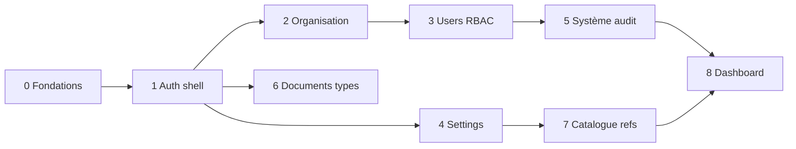

# Roadmap Admin Sinfinity

Plan de développement de la console d’administration Next.js (`apps/admin`, port **3001**), consommant l’API NestJS (`apps/api`, port **4000**).

Ce document suit le même flux que le roadmap API : **une branche principale par phase**, puis **des branches secondaires parallélisables** (idéalement une par agent / une par PR). Chaque branche secondaire a un **prompt copiable** à coller dans Cursor.

**Périmètre Admin (oui / non)**

| Oui — console d’administration | Non — réservé à Web (`:3000`) ou POS (`:3002`) |
|--------------------------------|--------------------------------------------------|
| Organisations, agences, utilisateurs, rôles | Pipeline CRM, devis, commandes, sourcing |
| Paramétrage global (devises, taxes, geo…) | Workflows opérationnels (import, stock, livraison) |
| Paramètres système, audit, journaux de connexion | Caisse / point de vente |
| Types documentaires, référentiels catalogue | Installation terrain, maintenance, facturation métier |

L’Admin **ne réimplémente pas** le métier : elle orchestre les écrans de configuration et de gouvernance sur l’API déjà livrée (voir [`apps/api/docs/ROADMAP.md`](../../api/docs/ROADMAP.md)).

**Sources de vérité**

| Sujet | Fichier |
|-------|---------|
| Roadmap API (dépendances endpoints) | [`apps/api/docs/ROADMAP.md`](../../api/docs/ROADMAP.md) |
| DDL MySQL | [`database/sql/sinfinity_schema.sql`](../../../database/sql/sinfinity_schema.sql) |
| Dictionnaire | [`database/dictionnaire-donnees.md`](../../../database/dictionnaire-donnees.md) |
| Modules métier | [`database/modules/`](../../../database/modules/) |
| Règles Next.js (cette app) | [`apps/admin/AGENTS.md`](../AGENTS.md) |

L’Admin est aujourd’hui un scaffold Next.js 16 (App Router, React 19, Tailwind 4) sans auth ni client API. La phase 0 pose ces fondations.

---

## Comment utiliser ce roadmap

1. Respecter l’**ordre d’exécution** (les écrans Admin dépendent des phases API correspondantes).
2. Créer la **branche principale** de la phase depuis `develop` (ou `main`).
3. Pour chaque **branche secondaire** : partir de la principale, coller le **prompt socle** + le **prompt spécifique**, implémenter, ouvrir une PR vers la principale.
4. Quand toutes les secondaires sont fusionnées : PR de la principale vers `develop`.

```text
develop
  └── feat/admin-m01-organisation          ← branche principale
        ├── feat/admin-m01-orgs            ← secondaire → PR vers m01
        ├── feat/admin-m01-branches
        └── feat/admin-m01-users
```

**Prérequis API** : pour une phase Admin N, les endpoints de la phase API équivalente doivent être disponibles (ou mockés explicitement — à éviter). Vérifier Swagger : [http://localhost:4000/docs](http://localhost:4000/docs).

---

## Ordre d’exécution recommandé

| Phase | Domaine | Branche principale | Dépend de (Admin) | Dépend de (API) |
|------:|---------|--------------------|-------------------|-----------------|
| 0 | Fondations techniques | `feat/admin-p00-foundations` | — | API P0 (health, CORS) |
| 1 | Auth & shell | `feat/admin-p01-shell` | 0 | API M01 auth |
| 2 | Organisation & agences | `feat/admin-m01-organisation` | 1 | API M01 orgs / branches |
| 3 | Utilisateurs & RBAC | `feat/admin-m01-security` | 2 | API M01 users / rbac |
| 4 | Paramétrage global | `feat/admin-m18-settings` | 1 | API M18 settings |
| 5 | Système & audit | `feat/admin-m01-ops` | 3 | API M01 audit / system-settings |
| 6 | Types documentaires | `feat/admin-m16-documents` | 1 | API M16 documents |
| 7 | Référentiels catalogue | `feat/admin-m03-catalogue` | 4 | API M03 catalogue |
| 8 | Tableau de bord & polish | `feat/admin-p08-dashboard` | 2–5 | API health + lectures |



---

## Conventions communes (toutes les branches)

### Git

- Branche principale : `feat/admin-mXX-slug` (ou `feat/admin-p00-foundations`).
- Branche secondaire : `feat/admin-mXX-detail`, créée **depuis** la principale, fusionnée **vers** la principale.
- Un sujet = une branche = une PR. Pas de mélange de domaines Admin.
- Ne pas pousser de secrets (`.env`). Utiliser `.env.example`.

### Next.js / UI

- App Router sous `apps/admin/src/app/`.
- Lire [`AGENTS.md`](../AGENTS.md) et la doc Next locale (`node_modules/next/dist/docs/`) avant d’utiliser une API Next — la version 16 peut différer du training.
- Port dev **3001** (`next dev --port 3001`).
- Tailwind 4 ; pas d’UI kit imposé tant qu’aucun package partagé n’existe dans `packages/`.
- UI en **français** (libellés, toasts, erreurs utilisateur). Code / noms de fichiers en anglais.
- Pas d’appels SQL depuis Admin : **uniquement** l’API REST `/api/v1`.
- Isolation multi-tenant : l’`organization_id` vient du JWT / contexte API, jamais hardcodé côté UI.
- Montants : afficher avec la devise ; ne jamais parser en `number` flottant pour des calculs métier (string / decimal lib si besoin).
- Soft delete : masquer les lignes `deleted_at` ; actions « désactiver » / « archiver » selon l’API.

### Auth & permissions

- Tokens : access + refresh (cookies httpOnly **ou** storage sécurisé — choisir une stratégie en phase 1 et s’y tenir).
- Après login : charger `GET /auth/me` + permissions (`GET /me/permissions` ou équivalent).
- Cacher / désactiver les actions UI selon les codes `module.action` (ex. `users.write`, `settings.read`).
- Rôle cible de la console : **ADMIN** (et super-admin org si l’API le prévoit). Rediriger les comptes sans droits admin hors de la console.

### Client API

- Base URL via `NEXT_PUBLIC_API_URL` (ex. `http://localhost:4000/api/v1`).
- Intercepteur : Bearer, refresh sur 401, erreurs normalisées `{ statusCode, message, error }`.
- Types TypeScript alignés sur les DTO Swagger (génération optionnelle plus tard ; pas de duplication inventée).

### Definition of Done (branche secondaire)

- [ ] Écrans / composants demandés, branchés sur l’API réelle
- [ ] États loading / empty / error / success
- [ ] Respect des permissions (`*.read` / `*.write`)
- [ ] Formulaires validés (côté client) + messages d’erreur API affichés
- [ ] Responsive utilisable (desktop prioritaire, mobile lisible)
- [ ] Aucune colonne / champ inventé : coller au DDL / Swagger
- [ ] README Admin mis à jour si le démarrage ou les variables d’env changent

---

## Prompt socle (à coller avant chaque prompt spécifique)

```text
Tu travailles dans le monorepo Sinfinity, package @sinfinity/admin (Next.js 16 App Router, React 19, Tailwind 4, port 3001).

Contexte produit : console d’ADMINISTRATION multi-tenant (pas l’UI métier Web).
Cycle métier global (rappel) : Lead → Devis → Commande → Sourcing → Achat → Import RDC → Stock → Livraison → Installation → Maintenance → Facturation.
L’Admin configure et gouverne ; Web/POS exécutent le métier.

Sources de vérité (ne pas inventer de champs) :
- database/sql/sinfinity_schema.sql
- database/modules/<MODULE>.md  (celui de la phase)
- apps/api/docs/ROADMAP.md      (endpoints déjà définis)
- apps/admin/docs/ROADMAP.md
- apps/admin/AGENTS.md          (conventions Next de cette app)

Stack attendue (posée en phase 0, à réutiliser) :
- Client HTTP typé vers NEXT_PUBLIC_API_URL (/api/v1)
- Auth JWT (access + refresh) + contexte user / org / permissions
- Layout shell (sidebar, topbar), design tokens CSS
- Listes paginées, formulaires, toasts d’erreur API

Règles :
1. Consommer uniquement l’API Nest ; pas d’accès MySQL depuis Admin.
2. Isolation organization_id via le contexte auth API.
3. UI en français ; code en anglais.
4. Permissions module.action pour afficher / autoriser les actions.
5. Ne pas construire les écrans métier Web (CRM, devis, stock opérationnel…).
6. Lire la doc Next locale avant d’utiliser une API framework récente.
7. Répondre en français dans le résumé de fin.

À la fin : lister les routes UI ajoutées, les endpoints API consommés, et comment lancer Admin + API pour tester.
```

---

# Phase 0 — Fondations techniques

## Objectif

Rendre l’Admin **démarrable, configurable, capable d’appeler l’API**, avec une base UI commune **avant** tout écran métier admin. Sans cette phase, les agents suivants inventent dix clients HTTP et dix layouts.

## Branche principale

`feat/admin-p00-foundations`

## Branches secondaires

| Branche | Portée |
|---------|--------|
| `feat/admin-p00-config` | Env, `.env.example`, `NEXT_PUBLIC_API_URL`, scripts README |
| `feat/admin-p00-api-client` | Fetch/client HTTP, erreurs, types de base pagination |
| `feat/admin-p00-ui-kit` | Tokens CSS, typo, boutons, inputs, table, modal, toast |
| `feat/admin-p00-health` | Page diagnostic : ping `GET /health` API |

## Prompt branches secondaires

### `feat/admin-p00-config`

```text
[Coller le prompt socle]

Branche : feat/admin-p00-config
Objectif : variables d’environnement Admin.
- .env.example avec NEXT_PUBLIC_API_URL=http://localhost:4000/api/v1
- Documenter pnpm --filter @sinfinity/admin dev (port 3001) dans apps/admin/README.md
- Remplacer le boilerplate create-next-app de page.tsx par une page d’accueil minimale « Sinfinity Admin »
- Pas encore d’auth ni de layout métier
```

### `feat/admin-p00-api-client`

```text
[Coller le prompt socle]

Branche : feat/admin-p00-api-client
Objectif : module src/lib/api (ou équivalent) :
- apiFetch(path, options) avec base URL, JSON, headers
- Types PaginationMeta / PaginatedResponse alignés API
- Mapping des erreurs { statusCode, message, error }
- Stub d’injection Authorization (hooké en phase 1)
Pas d’écrans métier. Tester contre GET /health si l’API tourne.
```

### `feat/admin-p00-ui-kit`

```text
[Coller le prompt socle]

Branche : feat/admin-p00-ui-kit
Objectif : primitives UI réutilisables sous src/components/ui :
Button, Input, Select, Textarea, Checkbox, Badge, Table, Pagination,
Modal/Dialog, Spinner, EmptyState, Alert/Toast.
Tokens CSS (couleurs, spacing, radius) — éviter le look générique purple/cream AI.
Pas de dépendance shadcn obligatoire ; rester cohérent et léger.
Documenter un petit showcase /story route interne optionnelle (dev only).
```

### `feat/admin-p00-health`

```text
[Coller le prompt socle]

Branche : feat/admin-p00-health
Objectif : route /system/health (ou section sur l’accueil) qui appelle GET /health
et affiche statut API + version. Utile pour valider CORS et le client HTTP.
Pas d’auth requise si l’endpoint health est public.
```

## Explication littéraire (branches secondaires)

La phase 0 fixe le **contrat de travail** : une URL d’API, un client unique, des briques UI stables. Le ping health est la preuve que Admin parle bien à Nest avant d’enchaîner login et CRUD.

---

# Phase 1 — Auth & shell applicatif

## Objectif

Permettre à un administrateur de **se connecter**, de voir un **shell** (sidebar + topbar) et d’être **redirigé** selon ses permissions. Tous les écrans suivants s’insèrent dans ce cadre.

Doc métier : [`database/modules/01_organisation_securite.md`](../../../database/modules/01_organisation_securite.md)  
API : phases auth de `feat/api-m01-organisation`

## Branche principale

`feat/admin-p01-shell`

## Branches secondaires

| Branche | Portée |
|---------|--------|
| `feat/admin-p01-auth` | Login, logout, refresh, garde de routes |
| `feat/admin-p01-session` | Contexte user / org / permissions |
| `feat/admin-p01-layout` | Sidebar, topbar, navigation Admin, breadcrumb |
| `feat/admin-p01-guards` | Protection pages + masquage menu selon permissions |

## Prompt branches secondaires

### `feat/admin-p01-auth`

```text
[Coller le prompt socle — module 01]

Branche : feat/admin-p01-auth
Pages /login (email + mot de passe) → POST /auth/login.
Stocker access + refresh selon la stratégie choisie (préférer cookies httpOnly
via route handlers Next si possible ; sinon documenter le choix).
POST /auth/logout, refresh automatique sur 401.
Page /login publique ; le reste de l’app protégé.
UI française, erreurs API affichées clairement.
```

### `feat/admin-p01-session`

```text
[Coller le prompt socle — module 01]

Branche : feat/admin-p01-session
Après auth : GET /auth/me + permissions.
Provider React (ou équivalent) exposant user, organization, permissions[],
hasPermission(code). Hook useAuth / usePermissions.
Gérer le cas session expirée → redirect /login.
```

### `feat/admin-p01-layout`

```text
[Coller le prompt socle — module 01]

Branche : feat/admin-p01-layout
Layout authentifié : sidebar (Organisation, Utilisateurs, Rôles, Paramètres,
Documents, Catalogue, Audit, Système), topbar (org name, user, logout).
Navigation App Router groups (dashboard)/... 
Mobile : sidebar collapsible. Pas encore de contenu métier dans les pages liées
( stubs « À venir » acceptables).
```

### `feat/admin-p01-guards`

```text
[Coller le prompt socle — module 01]

Branche : feat/admin-p01-guards
Middleware ou layout guard : non authentifié → /login.
Authentifié sans droit admin pertinent → page /forbidden.
Helper <Can permission="users.write"> pour boutons.
Masquer les entrées de menu sans *.read correspondant.
```

## Explication littéraire (branches secondaires)

L’**auth** ouvre la porte ; la **session** dit qui on est ; le **layout** dit où on va ; les **guards** empêchent de cliquer là où l’API refuserait quand même. Séparer ces quatre sujets évite une PR monolithe « tout le shell ».

---

# Phase 2 — Organisation & agences

## Objectif

Écrans de gestion du **tenant** et des **agences / entrepôts** (branches).

Doc : [`database/modules/01_organisation_securite.md`](../../../database/modules/01_organisation_securite.md)  
API : `organizations`, `branches`

## Branche principale

`feat/admin-m01-organisation`

## Branches secondaires

| Branche | Portée |
|---------|--------|
| `feat/admin-m01-orgs` | Fiche organisation (lecture / édition) |
| `feat/admin-m01-branches` | Liste + CRUD agences |

## Prompt branches secondaires

### `feat/admin-m01-orgs`

```text
[Coller le prompt socle — module 01]

Branche : feat/admin-m01-orgs
UI organisation courante : afficher / éditer legal_name, tax_id, email, phone,
website, logo_url, default_currency_id, country_id, is_active.
Selects alimentés par settings (currencies, countries) — stub si phase 4 absente.
Permissions organizations.read / organizations.write.
Si l’API expose un create super-admin : écran bootstrap optionnel, sinon hors scope.
```

### `feat/admin-m01-branches`

```text
[Coller le prompt socle — module 01]

Branche : feat/admin-m01-branches
Liste paginée des branches (filtre type, is_active, search).
Formulaire create/edit : code, name, type office/warehouse/mixed, address,
city_id, phone, manager_user_id (nullable), is_active.
Permissions branches.read / branches.write.
```

## Explication littéraire (branches secondaires)

L’**organisation** est la fiche identité du tenant ; les **agences** sont le découpage opérationnel (bureau vs entrepôt). Deux PRs distinctes pour ne pas bloquer le CRUD agences sur le logo org.

---

# Phase 3 — Utilisateurs & RBAC

## Objectif

Administrer les **comptes**, les **rôles** et la **matrice de permissions**.

Doc : [`database/modules/01_organisation_securite.md`](../../../database/modules/01_organisation_securite.md)  
API : `users`, `roles`, `permissions`, `user_roles`

## Branche principale

`feat/admin-m01-security`

## Branches secondaires

| Branche | Portée |
|---------|--------|
| `feat/admin-m01-users` | CRUD utilisateurs, activation, reset |
| `feat/admin-m01-roles` | CRUD rôles org + affectation permissions |
| `feat/admin-m01-user-roles` | Affectation rôles aux utilisateurs |

## Prompt branches secondaires

### `feat/admin-m01-users`

```text
[Coller le prompt socle — module 01]

Branche : feat/admin-m01-users
Liste users (search, is_active, branch_id). Fiche create/edit :
email, first_name, last_name, phone, branch_id, is_active.
Jamais afficher password_hash. Actions : activer/désactiver, reset password
si l’API le fournit. Permissions users.read / users.write.
```

### `feat/admin-m01-roles`

```text
[Coller le prompt socle — module 01]

Branche : feat/admin-m01-roles
Liste rôles (système + org). Édition name/description pour rôles org.
Matrice permissions (groupées par module) avec cases à cocher → role_permissions.
Rôles is_system : non suppressibles, permissions éventuellement read-only
selon règles API. Permissions roles.read / roles.write.
```

### `feat/admin-m01-user-roles`

```text
[Coller le prompt socle — module 01]

Branche : feat/admin-m01-user-roles
Sur la fiche user (ou page dédiée) : assigner / retirer des rôles,
branch_id optionnel par affectation si l’API le permet.
Permissions roles.write (ou users.write selon contrat API — coller à Swagger).
```

## Explication littéraire (branches secondaires)

Créer un **utilisateur** n’est pas dessiner la **matrice RBAC** ; lier les deux est un troisième geste. Trois branches = trois PRs reviewables.

---

# Phase 4 — Paramétrage global (Settings)

## Objectif

UI d’administration des **référentiels** : géographie, monnaies, taxes, unités, conditions de paiement et Incoterms.

Doc : [`database/modules/18_settings.md`](../../../database/modules/18_settings.md)  
API : phase `feat/api-m18-settings`

## Branche principale

`feat/admin-m18-settings`

## Branches secondaires

| Branche | Portée |
|---------|--------|
| `feat/admin-m18-geo` | Pays, villes |
| `feat/admin-m18-money` | Devises, taux, taxes |
| `feat/admin-m18-terms` | Unités, payment terms, shipping terms |
| `feat/admin-m18-seeds-ui` | Bouton seed (dev) si `POST /settings/seed` existe |

## Prompt branches secondaires

### `feat/admin-m18-geo`

```text
[Coller le prompt socle — module 18]

Branche : feat/admin-m18-geo
Pages Paramètres → Pays / Villes.
CRUD + filtres (code ISO, search, country_id).
Permissions settings.read / settings.write.
```

### `feat/admin-m18-money`

```text
[Coller le prompt socle — module 18]

Branche : feat/admin-m18-money
CRUD currencies, exchange_rates (unicité from/to/date), taxes.
Afficher les DECIMAL en string formatée ; jamais float JS pour les taux.
Endpoint latest taux si exposé. Permissions settings.read / settings.write.
```

### `feat/admin-m18-terms`

```text
[Coller le prompt socle — module 18]

Branche : feat/admin-m18-terms
CRUD units, payment_terms, shipping_terms (Incoterms).
Listes claires pour relecture admin. Permissions settings.*.
```

### `feat/admin-m18-seeds-ui`

```text
[Coller le prompt socle — module 18]

Branche : feat/admin-m18-seeds-ui
En NODE_ENV=development uniquement : action UI « Charger les seeds settings »
→ POST /settings/seed (settings.write). Confirmation destructive-safe (upsert).
Masquer en production. Documenter dans README Admin.
```

## Explication littéraire (branches secondaires)

Les référentiels sont découpés comme côté API : **geo**, **money**, **terms**. La UI seed reste isolée pour ne jamais fuiter un bouton dangereux en prod.

---

# Phase 5 — Paramètres système & audit

## Objectif

Éditer les **system_settings** (clé / JSON) et consulter les **journaux d’audit** et de **connexion**.

Doc : [`database/modules/01_organisation_securite.md`](../../../database/modules/01_organisation_securite.md)  
API : `system_settings`, `audit_logs`, `login_logs`

## Branche principale

`feat/admin-m01-ops`

## Branches secondaires

| Branche | Portée |
|---------|--------|
| `feat/admin-m01-system-settings` | Éditeur clé/valeur JSON |
| `feat/admin-m01-audit` | Liste audit_logs (lecture seule) |
| `feat/admin-m01-login-logs` | Liste login_logs (lecture seule) |

## Prompt branches secondaires

### `feat/admin-m01-system-settings`

```text
[Coller le prompt socle — module 01]

Branche : feat/admin-m01-system-settings
UI GET/PUT system-settings et par clé.
Éditeur JSON validé (erreur parse côté client).
Permissions system_settings.read / system_settings.write.
```

### `feat/admin-m01-audit`

```text
[Coller le prompt socle — module 01]

Branche : feat/admin-m01-audit
Table paginée audit_logs : date, user, action, entity_type, entity_id.
Filtres + tiroir détail old/new JSON (lecture seule, pas de delete).
Permission audit.read.
```

### `feat/admin-m01-login-logs`

```text
[Coller le prompt socle — module 01]

Branche : feat/admin-m01-login-logs
Liste login_logs (succès/échec, ip, user_agent, date).
Filtres email/user, statut. Lecture seule. Permission audit.read
(ou celle exposée par l’API — coller à Swagger).
```

## Explication littéraire (branches secondaires)

Les **system_settings** sont de la config vivante ; l’**audit** et les **login logs** sont de la conformité. Les séparer évite de mélanger un éditeur JSON avec une table append-only.

---

# Phase 6 — Types documentaires

## Objectif

Administrer le **catalogue de types de documents** (et métadonnées associées) utilisés ensuite par Web pour rattacher des fichiers.

Doc : [`database/modules/16_documents.md`](../../../database/modules/16_documents.md)  
API : phase `feat/api-m16-documents`

## Branche principale

`feat/admin-m16-documents`

## Branches secondaires

| Branche | Portée |
|---------|--------|
| `feat/admin-m16-doc-types` | CRUD document_types |
| `feat/admin-m16-doc-browse` | Exploration lecture des documents (optionnel admin) |

## Prompt branches secondaires

### `feat/admin-m16-doc-types`

```text
[Coller le prompt socle — module 16]

Branche : feat/admin-m16-doc-types
CRUD des types documentaires alignés DDL / Swagger
(code, name, allowed mime, flags…). Permissions documents.* selon API.
Pas d’upload métier complexe ici — focus configuration.
```

### `feat/admin-m16-doc-browse`

```text
[Coller le prompt socle — module 16]

Branche : feat/admin-m16-doc-browse
Liste en lecture des documents (filtres entity_type, type) pour support admin.
Pas de remplacement du module Documents Web ; usage diagnostic / support.
```

## Explication littéraire (branches secondaires)

L’Admin **définit les types** ; Web **attache les fichiers** aux dossiers métier. La browse admin reste un outil de support, volontairement secondaire.

---

# Phase 7 — Référentiels catalogue

## Objectif

Gérer les **données de référence catalogue** (marques, catégories, catégories de services) sans les écrans opérationnels produits complets de Web — ou avec un CRUD produit minimal si l’équipe Admin doit bootstrap le catalogue.

Doc : [`database/modules/03_catalogue.md`](../../../database/modules/03_catalogue.md)  
API : phase `feat/api-m03-catalogue`

## Branche principale

`feat/admin-m03-catalogue`

## Branches secondaires

| Branche | Portée |
|---------|--------|
| `feat/admin-m03-brands` | Marques |
| `feat/admin-m03-categories` | Catégories produits (+ services) |
| `feat/admin-m03-products-lite` | CRUD produit minimal (SKU, nom, statut) — optionnel |

## Prompt branches secondaires

### `feat/admin-m03-brands`

```text
[Coller le prompt socle — module 03]

Branche : feat/admin-m03-brands
CRUD brands selon API. Liste + formulaire. Permissions catalogue / products
selon codes Swagger.
```

### `feat/admin-m03-categories`

```text
[Coller le prompt socle — module 03]

Branche : feat/admin-m03-categories
CRUD product categories (arbre si parent_id) et service categories.
UI arborescente simple si l’API renvoie parent_id.
```

### `feat/admin-m03-products-lite`

```text
[Coller le prompt socle — module 03]

Branche : feat/admin-m03-products-lite
CRUD produit allégé : SKU, name, brand, category, status, unités de base.
Pas de fiche technique complète (specs, images avancées) — laisser à Web
si le roadmap Web le prévoit. Documenter la frontière Admin vs Web.
```

## Explication littéraire (branches secondaires)

Les **marques** et **catégories** sont du référentiel pur. Le **produit lite** n’existe que pour débloquer un catalogue vide ; la richesse catalogue reste côté Web.

---

# Phase 8 — Tableau de bord & polish

## Objectif

Donner une **vue d’accueil** utile à l’admin (compteurs, liens rapides, santé API) et figer la qualité UX transversale (états vides, 403/404, i18n figée FR).

## Branche principale

`feat/admin-p08-dashboard`

## Branches secondaires

| Branche | Portée |
|---------|--------|
| `feat/admin-p08-home` | Dashboard : compteurs users/branches, liens, health |
| `feat/admin-p08-errors` | Pages 403 / 404 / erreur API globale |
| `feat/admin-p08-ux` | Empty states, confirmations destructives, accessibilité de base |

## Prompt branches secondaires

### `feat/admin-p08-home`

```text
[Coller le prompt socle]

Branche : feat/admin-p08-home
Dashboard / : cartes résumé (nb users actifs, branches, dernière connexion),
liens vers Organisation / Users / Settings / Audit, statut GET /health.
Uniquement des lectures API déjà existantes — pas de nouveau endpoint métier
sauf agrégats déjà exposés.
```

### `feat/admin-p08-errors`

```text
[Coller le prompt socle]

Branche : feat/admin-p08-errors
Pages not-found, forbidden, error boundary App Router.
Messages FR clairs. Bouton retour dashboard / login.
```

### `feat/admin-p08-ux`

```text
[Coller le prompt socle]

Branche : feat/admin-p08-ux
Passer en revue listes existantes : EmptyState, confirmations delete/désactivation,
focus clavier formulaires, labels associés. Pas de nouvelle feature métier.
```

## Explication littéraire (branches secondaires)

Le **dashboard** ancre la console ; les **erreurs** évitent les écrans blancs ; le **polish UX** homogénéise ce que les phases précédentes ont livré chacune dans leur coin.

---

## Hors scope explicite (roadmap Web / POS)

Ne pas planifier dans Admin (sauf décision produit écrite) :

- CRM (leads, opportunités, activités commerciales)
- Devis, commandes clients, paiements clients
- Sourcing, achats, landed cost, logistique import
- Stock opérationnel, transferts, inventaires physiques
- Livraisons, projets, maintenance, facturation complète
- POS / caisse

Ces domaines ont (ou auront) leur roadmap UI dédiée sous `apps/web` et `apps/pos`.

---

## Récapitulatif navigation cible

| Menu Admin | Phase | Permissions typiques |
|------------|------:|----------------------|
| Tableau de bord | 8 | authentifié admin |
| Organisation | 2 | `organizations.*` |
| Agences | 2 | `branches.*` |
| Utilisateurs | 3 | `users.*` |
| Rôles & permissions | 3 | `roles.*` |
| Paramètres (geo / money / terms) | 4 | `settings.*` |
| Paramètres système | 5 | `system_settings.*` |
| Audit / connexions | 5 | `audit.read` |
| Types documentaires | 6 | `documents.*` |
| Catalogue (réfs) | 7 | permissions catalogue API |
| Santé système | 0 / 8 | public health + admin |

Une fois Admin lancé (`pnpm --filter @sinfinity/admin dev`) et l’API sur `:4000`, la console est sur [http://localhost:3001](http://localhost:3001).
