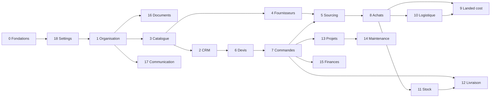

# Roadmap API Sinfinity

Plan de développement de l’API NestJS (`apps/api`, port **4000**), aligné sur les 18 modules du modèle de données et documenté avec **OpenAPI / Swagger**.

Ce document est conçu pour un flux **une branche principale par phase**, puis **des branches secondaires parallélisables** (idéalement une par agent / une par PR). Chaque branche secondaire a un **prompt copiable** à coller dans Cursor.

**Sources de vérité**

| Sujet | Fichier |
|-------|---------|
| DDL MySQL | [`database/sql/sinfinity_schema.sql`](../../../database/sql/sinfinity_schema.sql) |
| Dictionnaire | [`database/dictionnaire-donnees.md`](../../../database/dictionnaire-donnees.md) |
| Conventions SQL | [`database/conventions.md`](../../../database/conventions.md) |
| Module métier N | [`database/modules/`](../../../database/modules/) |

L’API est aujourd’hui un scaffold NestJS 11 sans couche SQL, sans auth et sans Swagger. La phase 0 pose ces fondations. **Prisma n’est pas utilisé** : le DDL MySQL reste la source de vérité.

---

## Comment utiliser ce roadmap

1. Respecter l’**ordre d’exécution** ci-dessous (les numéros de modules ne sont pas l’ordre Git).
2. Créer la **branche principale** de la phase depuis `develop` (ou `main`).
3. Pour chaque **branche secondaire** : partir de la branche principale, coller le **prompt socle** + le **prompt spécifique**, implémenter, documenter Swagger, ouvrir une PR vers la branche principale.
4. Quand toutes les secondaires sont fusionnées : PR de la branche principale vers `develop`.

```text
develop
  └── feat/api-m01-organisation          ← branche principale
        ├── feat/api-m01-auth            ← secondaire → PR vers m01
        ├── feat/api-m01-users
        └── feat/api-m01-rbac
```

---

## Ordre d’exécution recommandé

Les modules 1 à 18 du dossier `database/modules/` restent la numérotation métier. L’ordre Git suit les **dépendances** (référentiels → sécurité → master data → cycle commercial → import → stock → après-vente).

| Phase | Module | Branche principale | Dépend de |
|------:|--------|--------------------|-----------|
| 0 | Fondations techniques | `feat/api-p00-foundations` | — |
| 1 | 18 — Paramétrage global | `feat/api-m18-settings` | 0 |
| 2 | 1 — Organisation et sécurité | `feat/api-m01-organisation` | 0, 18 |
| 3 | 16 — Documents | `feat/api-m16-documents` | 1 |
| 4 | 3 — Catalogue | `feat/api-m03-catalogue` | 1, 18 |
| 5 | 2 — CRM et clients | `feat/api-m02-crm` | 1, 3, 18 |
| 6 | 4 — Fournisseurs | `feat/api-m04-fournisseurs` | 1, 3, 16, 18 |
| 7 | 6 — Devis | `feat/api-m06-quotations` | 2, 3, 18 |
| 8 | 7 — Commandes clients | `feat/api-m07-sales-orders` | 6, 16 |
| 9 | 5 — Demandes de sourcing | `feat/api-m05-procurement` | 2, 4, 8 |
| 10 | 8 — Achats fournisseurs | `feat/api-m08-purchase-orders` | 5, 16, 18 |
| 11 | 10 — Logistique et import | `feat/api-m10-logistique` | 8, 16, 18 |
| 12 | 9 — Coût rendu RDC | `feat/api-m09-landed-costs` | 8, 11 |
| 13 | 11 — Stock | `feat/api-m11-stock` | 3, 8, 10 |
| 14 | 12 — Livraison | `feat/api-m12-delivery` | 8, 11, 16 |
| 15 | 13 — Projets et installation | `feat/api-m13-projets` | 8, 11, 16 |
| 16 | 14 — Maintenance | `feat/api-m14-maintenance` | 2, 13 |
| 17 | 15 — Finances | `feat/api-m15-finances` | 8, 10, 12 |
| 18 | 17 — Communication | `feat/api-m17-communication` | 1 |



---

## Conventions communes (toutes les branches)

### Git

- Branche principale : `feat/api-mXX-slug` (ou `feat/api-p00-foundations`).
- Branche secondaire : `feat/api-mXX-detail`, créée **depuis** la principale, fusionnée **vers** la principale.
- Un sujet = une branche = une PR. Pas de mélange de modules.
- Ne pas pousser de secrets (`.env`). Utiliser `.env.example`.

### NestJS

- Un module Nest par domaine (`src/modules/<domaine>/`).
- Couche : `controller` → `service` → repository Drizzle / SQL.
- Accès données : **mysql2 + Drizzle**. Pas de Prisma. Le fichier [`database/sql/sinfinity_schema.sql`](../../../database/sql/sinfinity_schema.sql) est la source de vérité ; Drizzle s’aligne dessus (introspection), il ne régénère pas le DDL.
- Migrations incrémentales uniquement dans `database/sql/migrations/` (jamais via un générateur ORM).
- DTOs `class-validator` + `@ApiProperty` / `@ApiPropertyOptional`.
- Isolation multi-tenant : **toute** requête métier filtre `organization_id` (jamais seulement en SQL).
- Soft delete via `deleted_at` quand la table le prévoit. Pas de soft delete sur `audit_logs`, `login_logs`, `*_status_history`, `inventory_movements`.
- Montants / quantités : `DECIMAL` côté DB, `string` ou decimal.js côté API — jamais `float`.
- UUID `CHAR(36)` générés côté application (UUID v7 de préférence).

### Swagger (obligatoire)

- UI : `GET /docs` (JSON : `GET /docs-json`).
- Préfixe HTTP : `/api/v1`.
- `@ApiTags` = nom du module métier (ex. `CRM`, `Devis`, `Stock`).
- `@ApiBearerAuth()` sur toutes les routes authentifiées.
- Chaque endpoint : `@ApiOperation`, `@ApiResponse` (200/201, 400, 401, 403, 404).
- Schémas d’erreur uniformes `{ "statusCode", "message", "error" }`.
- Exemples réalistes (USD/CDF, NIF, SKU, n° de BC).
- Tag `Auth` pour login / refresh (sans Bearer sur login).

### Definition of Done (branche secondaire)

- [ ] Endpoints CRUD / actions demandés, scopés par organisation
- [ ] DTOs validés, Swagger complet et cohérent
- [ ] Guards JWT + permissions (`code` du type `quotations.approve`)
- [ ] Tests unitaires du service + au moins un test e2e des routes principales
- [ ] Aucune colonne inventée : coller au DDL
- [ ] README du module mis à jour si un fichier `apps/api/docs/modules/` existe déjà

---

## Prompt socle (à coller avant chaque prompt spécifique)

```text
Tu travailles dans le monorepo Sinfinity, package @sinfinity/api (NestJS 11, port 4000).

Contexte produit : ERP/CRM multi-tenant pour le cycle
Lead → Devis → Commande → Sourcing → Achat → Import RDC → Stock → Livraison → Installation → Maintenance → Facturation.

Sources de vérité (ne pas inventer de colonnes ni de tables) :
- database/sql/sinfinity_schema.sql
- database/conventions.md
- database/modules/<MODULE>.md  (celui de la phase en cours)
- apps/api/docs/ROADMAP.md

Stack attendue (déjà posée en phase 0, à réutiliser) :
- MySQL 8 via mysql2 + Drizzle (pas de Prisma)
- @nestjs/swagger, préfixe /api/v1, UI /docs
- JWT (access + refresh) + sessions (user_sessions)
- Guards : JwtAuthGuard, OrganizationGuard, PermissionsGuard
- Pagination, filtres, tri, exception filter, interceptor d’audit
- class-validator / class-transformer

Règles :
1. Isolation stricte par organization_id sur toutes les données opérationnelles.
2. Soft delete seulement si deleted_at existe sur la table.
3. Documenter chaque endpoint Swagger (tags, operation, responses, bearer).
4. Permissions au format module.action (ex. customers.read, quotations.approve).
5. Ne pas modifier un autre module sauf FK / import Nest indispensable.
6. Ajouter les tests (service + e2e des routes clés).
7. Répondre en français dans le résumé de fin, code en anglais (noms, messages d’API en anglais ou i18n keys — rester cohérent avec le code existant).
8. Ne jamais introduire Prisma. Accès SQL uniquement via mysql2 / Drizzle (ou SQL brut).

À la fin : lister les routes ajoutées, les tags Swagger, et comment lancer l’API pour les voir dans /docs.
```

---

# Phase 0 — Fondations techniques

## Objectif

Rendre l’API **démarrable, connectée à MySQL, documentée Swagger**, avec les briques transverses (config, pool SQL, pagination, erreurs, health) **avant** tout module métier. Sans cette phase, les agents suivants n’ont pas de cadre commun.

## Branche principale

`feat/api-p00-foundations`

## Branches secondaires

| Branche | Portée |
|---------|--------|
| `feat/api-p00-config` | ConfigModule, validation d’env, CORS, préfixe global `/api/v1` |
| `feat/api-p00-database` | mysql2 + Drizzle, mapping du DDL existant (sans Prisma) |
| `feat/api-p00-swagger` | OpenAPI, Bearer, tags vides, `/docs` |
| `feat/api-p00-common` | Pagination, filtres, exception filter, interceptors, pipes |
| `feat/api-p00-health` | Healthcheck DB + version |

## Prompt branches secondaires

### `feat/api-p00-config`

```text
[Coller le prompt socle]

Branche : feat/api-p00-config
Objectif : ConfigModule (@nestjs/config) + validation Joi/Zod des variables
DATABASE_URL, JWT_ACCESS_SECRET, JWT_REFRESH_SECRET, JWT_ACCESS_TTL, JWT_REFRESH_TTL,
PORT, CORS_ORIGINS, NODE_ENV. Préfixe global /api/v1, CORS pour localhost:3000/3001/3002.
Fichier .env.example. ValidationPipe global (whitelist, transform).
Ne pas encore brancher Drizzle / mysql2 ni Swagger.
```

### `feat/api-p00-database`

```text
[Coller le prompt socle]

Branche : feat/api-p00-database
Objectif : Brancher MySQL 8 dans apps/api avec mysql2 + Drizzle.
INTERDIT : Prisma (pas de schema.prisma, pas de PrismaService, pas de migrations Prisma).

Le schéma SQL existe déjà (database/sql/sinfinity_schema.sql) : c’est la source de vérité.
- Pool mysql2 lu depuis DATABASE_URL
- DatabaseModule / DrizzleModule global (injectable)
- Schéma Drizzle aligné sur le DDL (introspection drizzle-kit ou tables écrites à la main) :
  UUID CHAR(36), DECIMAL, JSON, soft delete, organization_id
- Ne pas générer ni écraser sinfinity_schema.sql depuis Drizzle
- Les évolutions de schéma se font en SQL dans database/sql/migrations/
- Documenter comment pointer DATABASE_URL vers la base locale
```

### `feat/api-p00-swagger`

```text
[Coller le prompt socle]

Branche : feat/api-p00-swagger
Objectif : @nestjs/swagger dans main.ts. DocumentBuilder : titre Sinfinity API,
version 1.0, serveur local :4000, Bearer JWT. UI sur /docs, JSON sur /docs-json.
Décorateurs de base sur le health (une fois fusionné) ou un endpoint ping.
Configurer extraModels si besoin. Documenter dans apps/api/README.md comment
ouvrir Swagger. Ne pas encore documenter de modules métier.
```

### `feat/api-p00-common`

```text
[Coller le prompt socle]

Branche : feat/api-p00-common
Objectif : module common/ réutilisable :
- PaginationQueryDto (page, pageSize, sort, order) + réponse { data, meta }
- ApiPaginatedResponse décorateur Swagger
- HttpExceptionFilter (format d’erreur unique)
- LoggingInterceptor léger
- ParseUUIDPipe custom si utile
- décorateur @CurrentUser() / @OrganizationId() (stubs tant que l’auth n’existe pas,
  mais signatures stables pour la phase 1)
Pas de logique métier.
```

### `feat/api-p00-health`

```text
[Coller le prompt socle]

Branche : feat/api-p00-health
Objectif : GET /api/v1/health (public) : statut up, ping MySQL (SELECT 1 via le pool), version package.
Swagger tag Health. Test e2e. Pas d’auth.
```

## Explication littéraire (branches secondaires)

La phase 0 ne vend rien au métier : elle **évite que dix agents inventent dix façons** de paginer, de lire l’env, ou de parler à MySQL. La config arrive en premier pour que personne ne hardcode un mot de passe. La couche SQL suit (mysql2 + Drizzle), parce que tout le reste parle aux tables — sans céder la vérité du schéma à un ORM. Swagger est posé tôt pour que **chaque PR suivante soit déjà visible dans `/docs`**, pas « documentée plus tard ». Le module `common` est le contrat social des DTO et des erreurs. Le healthcheck est la preuve que la base répond — indispensable avant d’enchaîner organisation et auth.

---

# Phase 1 — Module 18 · Paramétrage global

## Objectif

Exposer les **référentiels** (devises, taux, taxes, unités, pays, villes, conditions de paiement et Incoterms) dont presque toutes les FK métier dépendent. Seed USD / CDF / CNY / EUR et pays clés (CD, CN, AE, FR, BE).

Doc métier : [`database/modules/18_settings.md`](../../../database/modules/18_settings.md)

## Branche principale

`feat/api-m18-settings`

## Branches secondaires

| Branche | Portée |
|---------|--------|
| `feat/api-m18-geo` | `countries`, `cities` |
| `feat/api-m18-money` | `currencies`, `exchange_rates`, `taxes` |
| `feat/api-m18-terms` | `units`, `payment_terms`, `shipping_terms` |
| `feat/api-m18-seeds` | Seeds idempotents + endpoint admin de re-seed en dev |

## Prompt branches secondaires

### `feat/api-m18-geo`

```text
[Coller le prompt socle — module 18_settings.md]

Branche : feat/api-m18-geo
CRUD (admin) + listes publiques authentifiées pour countries et cities.
Filtres : code ISO, search name, country_id pour cities.
Unicité (country_id, name, region). Tag Swagger « Settings ».
Permissions : settings.read / settings.write.
```

### `feat/api-m18-money`

```text
[Coller le prompt socle — module 18_settings.md]

Branche : feat/api-m18-money
CRUD currencies (code ISO 4217). CRUD exchange_rates avec unicité
(from, to, rate_date) et endpoint GET /exchange-rates/latest?from=&to=&date=.
CRUD taxes (vat / customs / withholding), scoped org ou global si organization_id NULL.
DECIMAL, jamais float. Tag Swagger « Settings ».
Permissions : settings.read / settings.write.
```

### `feat/api-m18-terms`

```text
[Coller le prompt socle — module 18_settings.md]

Branche : feat/api-m18-terms
CRUD units, payment_terms, shipping_terms (Incoterms 2020 : EXW, FOB, CIF, DDU, DDP…).
Listes pour les selects UI. Tag Swagger « Settings ».
```

### `feat/api-m18-seeds`

```text
[Coller le prompt socle — module 18_settings.md]

Branche : feat/api-m18-seeds
Script de seed SQL (ou service Nest + Drizzle) idempotent : USD, CDF, CNY, EUR ;
pays CD, CN, AE, FR, BE et quelques villes (Kinshasa, Lubumbashi, Shenzhen, Dubai) ;
unités PCS/KG/BOX/M ; Incoterms de base ; TVA RDC 16 % si présente dans le DDL.
Fichier de préférence sous database/sql/seeds/ + commande documentée (mysql client
ou pnpm --filter @sinfinity/api seed). En NODE_ENV=development seulement,
POST /api/v1/settings/seed protégé admin. Ne pas écraser des lignes métier
déjà saisies (upsert sur codes). Pas de Prisma.
```

## Explication littéraire (branches secondaires)

Le paramétrage est volontairement **découpé par famille de référentiels** : la géographie n’a rien à voir avec un taux CNY/USD du jour, et les Incoterms sont un vocabulaire logistique stable. Les seeds sont une branche à part pour qu’on puisse les relancer sans recoder le CRUD, et pour que les phases suivantes (organisation, catalogue, devis) aient déjà des UUID de devises et de pays à lier.

---

# Phase 2 — Module 1 · Organisation et sécurité

## Objectif

Poser le **tenant**, les utilisateurs, le **RBAC**, les sessions JWT et l’audit. Toute route métier ultérieure s’appuie sur ces guards.

Doc métier : [`database/modules/01_organisation_securite.md`](../../../database/modules/01_organisation_securite.md)

## Branche principale

`feat/api-m01-organisation`

## Branches secondaires

| Branche | Portée |
|---------|--------|
| `feat/api-m01-organizations` | `organizations` (+ lien devise / pays) |
| `feat/api-m01-branches` | `branches` |
| `feat/api-m01-auth` | login, refresh, logout, `user_sessions`, `login_logs` |
| `feat/api-m01-users` | `users` (CRUD, mot de passe, activation) |
| `feat/api-m01-rbac` | `roles`, `permissions`, `role_permissions`, `user_roles` |
| `feat/api-m01-audit` | `audit_logs` lecture + interceptor d’écriture |
| `feat/api-m01-system-settings` | `system_settings` clé/valeur JSON |

## Prompt branches secondaires

### `feat/api-m01-organizations`

```text
[Coller le prompt socle — module 01_organisation_securite.md]

Branche : feat/api-m01-organizations
CRUD organizations. Super-admin only pour create (bootstrap premier tenant acceptable
via seed). Champs alignés DDL (legal_name, tax_id, default_currency_id, country_id).
Tag Swagger « Organisation ». Ne pas encore faire users/auth.
```

### `feat/api-m01-branches`

```text
[Coller le prompt socle — module 01_organisation_securite.md]

Branche : feat/api-m01-branches
CRUD branches scopé organization_id. ENUM type office/warehouse/mixed.
manager_user_id nullable (référence circulaire users — FK optionnelle).
Tag « Organisation ». Permissions : branches.read / branches.write.
```

### `feat/api-m01-auth`

```text
[Coller le prompt socle — module 01_organisation_securite.md]

Branche : feat/api-m01-auth
POST /auth/login (email + password) → accessToken + refreshToken.
POST /auth/refresh. POST /auth/logout (révocation session). GET /auth/me.
Hasher bcrypt/argon2. Persister user_sessions (token_hash, ip, user_agent, expires_at).
Écrire login_logs (succès/échec, jamais le mot de passe).
JwtAuthGuard fonctionnel. Swagger tag « Auth », login sans Bearer.
Mettre à jour last_login_at. Ne pas encore implémenter le CRUD users complet.
```

### `feat/api-m01-users`

```text
[Coller le prompt socle — module 01_organisation_securite.md]

Branche : feat/api-m01-users
CRUD users dans l’organisation courante. Jamais renvoyer password_hash.
Invite / reset password (endpoints minimaux : set-password avec token ou admin reset).
Filtres is_active, branch_id, search. Tag « Organisation ».
Permissions : users.read / users.write.
```

### `feat/api-m01-rbac`

```text
[Coller le prompt socle — module 01_organisation_securite.md]

Branche : feat/api-m01-rbac
Seed des permissions (codes module.action pour tous les modules prévus) et rôles
système : ADMIN, SALES, PROCUREMENT, LOGISTICS, TECHNICAL, FINANCE.
CRUD roles org (is_system non supprimable). Affectation user_roles (branch_id optionnel).
PermissionsGuard + décorateur @RequirePermissions('quotations.approve').
GET /me/permissions. Tag « Sécurité ».
```

### `feat/api-m01-audit`

```text
[Coller le prompt socle — module 01_organisation_securite.md]

Branche : feat/api-m01-audit
Interceptor qui écrit audit_logs (action, entity_type, entity_id, old/new JSON, ip)
sur mutations. GET /audit-logs paginé, filtres entity_type, user_id, date.
Append-only, pas de PATCH/DELETE. Tag « Sécurité ». Permission audit.read.
```

### `feat/api-m01-system-settings`

```text
[Coller le prompt socle — module 01_organisation_securite.md]

Branche : feat/api-m01-system-settings
GET/PUT /system-settings et GET/PUT /system-settings/:key.
Unicité (organization_id, key). Valeur JSON. Tag « Organisation ».
```

## Explication littéraire (branches secondaires)

On commence par l’**organisation** et les **agences** pour avoir un tenant réel, puis l’**auth** pour que les branches suivantes ne simulents plus l’utilisateur. Les **users** et le **RBAC** sont séparés : créer un compte n’est pas la même histoire que dessiner la matrice des droits. L’**audit** arrive après, parce qu’il a besoin d’un `user_id` fiable. Les **system_settings** ferment la phase : c’est le tiroir des défauts d’organisation (devise, format de numérotation) que les modules commerciaux liront plus tard.

---

# Phase 3 — Module 16 · Gestion documentaire

## Objectif

Fournir le **stockage de fichiers**, le versioning et les **liens polymorphes** (`document_links`) utilisés par les fournisseurs, commandes, BL, preuves de livraison, etc. Les contrats cadres vivent ici.

Doc métier : [`database/modules/16_documents.md`](../../../database/modules/16_documents.md)

## Branche principale

`feat/api-m16-documents`

## Branches secondaires

| Branche | Portée |
|---------|--------|
| `feat/api-m16-types` | `document_types` |
| `feat/api-m16-files` | upload / download `documents` + `document_versions` |
| `feat/api-m16-links` | `document_links` |
| `feat/api-m16-contracts` | `contracts`, `contract_items` |

## Prompt branches secondaires

### `feat/api-m16-types`

```text
[Coller le prompt socle — module 16_documents.md]

Branche : feat/api-m16-types
CRUD document_types (QUOTE, INVOICE, BL, CONTRACT…). allowed_mime_types JSON.
Seed types système. Tag « Documents ».
```

### `feat/api-m16-files`

```text
[Coller le prompt socle — module 16_documents.md]

Branche : feat/api-m16-files
POST multipart upload → documents (file_url local ou S3 abstrait via interface StorageService,
implémentation disque local pour le dev). GET métadonnées, GET download, POST nouvelle version
(document_versions). Checksum, mime, size. Soft status active/archived/deleted.
Swagger binary upload. Permissions documents.read / documents.write.
```

### `feat/api-m16-links`

```text
[Coller le prompt socle — module 16_documents.md]

Branche : feat/api-m16-links
POST/DELETE document_links (entity_type, entity_id, role). GET documents d’une entité.
Unicité (document_id, entity_type, entity_id). Valider entity_type contre une allowlist.
Tag « Documents ».
```

### `feat/api-m16-contracts`

```text
[Coller le prompt socle — module 16_documents.md]

Branche : feat/api-m16-contracts
CRUD contracts (client ou fournisseur) + contract_items. Statuts draft/active/expired/terminated.
Lien document_id PDF signé. Numérotation contract_number unique par org.
Tag « Documents ». Permissions contracts.read / contracts.write.
```

## Explication littéraire (branches secondaires)

Les **types** d’abord, pour ne pas uploader dans le vide. Les **fichiers** ensuite, avec une interface de stockage pour ne pas coller S3 dans le contrôleur. Les **liens** sont le cœur du modèle : un même PDF peut être pièce jointe d’un BC et d’une déclaration en douane. Les **contrats cadres** sont un objet métier distinct (dates, valeur, lignes) qui *réutilise* le document, ils ne sont pas « juste un fichier ».

---

# Phase 4 — Module 3 · Catalogue produits et services

## Objectif

Constituer le **référentiel commercial** : catégories, marques, modèles, produits (dont `is_serialized`), images, specs, services et associations produit–service.

Doc métier : [`database/modules/03_catalogue.md`](../../../database/modules/03_catalogue.md)

## Branche principale

`feat/api-m03-catalogue`

## Branches secondaires

| Branche | Portée |
|---------|--------|
| `feat/api-m03-taxonomy` | `product_categories`, `product_subcategories`, `product_brands`, `product_models` |
| `feat/api-m03-products` | `products`, `product_specifications`, `product_images` |
| `feat/api-m03-services` | `services`, `service_categories`, `product_services` |

## Prompt branches secondaires

### `feat/api-m03-taxonomy`

```text
[Coller le prompt socle — module 03_catalogue.md]

Branche : feat/api-m03-taxonomy
CRUD catégories (parent_id, sort_order), sous-catégories, marques, modèles
(manufacturer_sku). Listes arborescentes pour l’UI. SKU/code uniques par org.
Tag « Catalogue ». Permissions catalog.read / catalog.write.
```

### `feat/api-m03-products`

```text
[Coller le prompt socle — module 03_catalogue.md]

Branche : feat/api-m03-products
CRUD products (sku unique par org, is_serialized, prices DECIMAL, unit_id, currency_id).
Nested specs (clé/valeur) et images (is_primary). Recherche sku/name, filtres category/brand.
Ne pas gérer le stock ici. Tag « Catalogue ».
```

### `feat/api-m03-services`

```text
[Coller le prompt socle — module 03_catalogue.md]

Branche : feat/api-m03-services
CRUD service_categories, services (billing_type fixed/hourly/per_unit),
et product_services (is_required, default_quantity). Tag « Catalogue ».
```

## Explication littéraire (branches secondaires)

La **taxonomie** est le plan du rayon : sans catégories ni marques, le produit n’a pas d’étagère. Le **produit** porte le prix de base et le flag sérialisé qui conditionnera plus tard le stock. Les **services** sont volontairement à part : installer un switch n’est pas le switch, mais on les relie pour que le devis propose automatiquement une ligne d’installation.

---

# Phase 5 — Module 2 · CRM et clients

## Objectif

Couvrir le pipeline **prospect → client → opportunité**, avec contacts, adresses, notes et activités.

Doc métier : [`database/modules/02_crm_clients.md`](../../../database/modules/02_crm_clients.md)

## Branche principale

`feat/api-m02-crm`

## Branches secondaires

| Branche | Portée |
|---------|--------|
| `feat/api-m02-customers` | `customer_categories`, `customers`, `customer_contacts`, `customer_addresses`, `customer_notes` |
| `feat/api-m02-leads` | `lead_sources`, `leads`, conversion lead → customer |
| `feat/api-m02-opportunities` | `opportunities`, `opportunity_items` |
| `feat/api-m02-activities` | `activity_types`, `sales_activities` |

## Prompt branches secondaires

### `feat/api-m02-customers`

```text
[Coller le prompt socle — module 02_crm_clients.md]

Branche : feat/api-m02-customers
CRUD catégories + customers (type individual/organization, code unique org, owner_user_id).
Sous-ressources contacts (un is_primary) et addresses (billing/shipping/both).
Notes épinglables. Statuts active/inactive/blocked. Tag « CRM ».
Permissions : customers.read / customers.write.
```

### `feat/api-m02-leads`

```text
[Coller le prompt socle — module 02_crm_clients.md]

Branche : feat/api-m02-leads
CRUD lead_sources et leads. Workflow status new → contacted → qualified → converted|lost.
POST /leads/:id/convert crée un customer, lie converted_customer_id / converted_from_lead_id.
Tag « CRM ». Permissions leads.read / leads.write / leads.convert.
```

### `feat/api-m02-opportunities`

```text
[Coller le prompt socle — module 02_crm_clients.md]

Branche : feat/api-m02-opportunities
CRUD opportunities (stages, probability, amount) + opportunity_items
(product_id ou service_id). Recalcul indicatif du amount depuis les lignes si demandé.
Tag « CRM ». Permissions opportunities.read / opportunities.write.
```

### `feat/api-m02-activities`

```text
[Coller le prompt socle — module 02_crm_clients.md]

Branche : feat/api-m02-activities
Seed activity_types (CALL, EMAIL, MEETING, VISIT). CRUD sales_activities
polymorphes (related_type lead/customer/opportunity). Tag « CRM ».
```

## Explication littéraire (branches secondaires)

Le **client** est le dossier administratif (NIF, adresses, contacts). Le **lead** est le monde d’avant : on le convertit une fois, proprement, sans dupliquer. L’**opportunité** porte l’intention d’achat et les lignes qui préfigurent le devis. Les **activités** sont le journal du commercial, volontairement détachées pour qu’on puisse les poser sur un lead *ou* un client sans bloquer le CRUD fiche.

---

# Phase 6 — Module 4 · Fournisseurs et sourcing

## Objectif

Gérer le **master fournisseur** international / local, le catalogue fournisseur, les offres libres, les évaluations et l’historique.

Doc métier : [`database/modules/04_fournisseurs.md`](../../../database/modules/04_fournisseurs.md)

## Branche principale

`feat/api-m04-fournisseurs`

## Branches secondaires

| Branche | Portée |
|---------|--------|
| `feat/api-m04-suppliers` | `supplier_categories`, `suppliers`, contacts, adresses, `supplier_payment_terms` |
| `feat/api-m04-catalog` | `supplier_products` |
| `feat/api-m04-quotes` | `supplier_quotes`, `supplier_quote_items` |
| `feat/api-m04-quality` | `supplier_evaluations`, `supplier_documents`, `supplier_histories` |

## Prompt branches secondaires

### `feat/api-m04-suppliers`

```text
[Coller le prompt socle — module 04_fournisseurs.md]

Branche : feat/api-m04-suppliers
CRUD catégories, suppliers (status active/inactive/blacklisted, preferred, rating),
contacts, adresses (hq/warehouse/factory/billing), liaison payment_terms.
Tag « Fournisseurs ». Permissions suppliers.read / suppliers.write.
```

### `feat/api-m04-catalog`

```text
[Coller le prompt socle — module 04_fournisseurs.md]

Branche : feat/api-m04-catalog
CRUD supplier_products (supplier_sku, unit_price, moq, lead_time_days, is_available).
Liste « qui vend ce product_id ». Tag « Fournisseurs ».
```

### `feat/api-m04-quotes`

```text
[Coller le prompt socle — module 04_fournisseurs.md]

Branche : feat/api-m04-quotes
CRUD supplier_quotes + items (offres libres, distinctes des procurement_quotes).
Statuts draft/received/selected/rejected/expired. Tag « Fournisseurs ».
```

### `feat/api-m04-quality`

```text
[Coller le prompt socle — module 04_fournisseurs.md]

Branche : feat/api-m04-quality
CRUD evaluations (scores 1–5, overall, MAJ optionnelle de suppliers.rating).
Lien supplier_documents via module documents. Append supplier_histories
(event_type quote/po/payment/evaluation). Tag « Fournisseurs ».
```

## Explication littéraire (branches secondaires)

La **fiche fournisseur** est le passeport (pays, contacts, blacklist). Le **catalogue fournisseur** est la grille prix/délai/MOQ, distincte du catalogue interne. Les **offres libres** capturent un PDF reçu par WhatsApp sans demande de sourcing formelle. La branche **qualité** isole ce qui est subjectif (notes) et historique, pour ne pas alourdir le CRUD de base.

---

# Phase 7 — Module 6 · Devis commerciaux

## Objectif

Devis **versionnés**, conditions, circuit d’approbation interne, envoi client, puis passage vers commande.

Doc métier : [`database/modules/06_quotations.md`](../../../database/modules/06_quotations.md)

## Branche principale

`feat/api-m06-quotations`

## Branches secondaires

| Branche | Portée |
|---------|--------|
| `feat/api-m06-core` | `quotation_statuses`, `quotations`, `quotation_items`, `quotation_terms` |
| `feat/api-m06-versions` | `quotation_versions` (snapshot JSON) |
| `feat/api-m06-approvals` | `quotation_approvals` + transitions de statut |

## Prompt branches secondaires

### `feat/api-m06-core`

```text
[Coller le prompt socle — module 06_quotations.md]

Branche : feat/api-m06-core
Seed quotation_statuses (DRAFT, SENT, ACCEPTED, REJECTED, EXPIRED).
CRUD quotations + items (product ou service, discount, tax) + terms.
Calcul subtotal / tax_amount / total_amount côté serveur (DECIMAL).
quote_number unique par org. exchange_rate figé à l’émission.
Tag « Devis ». Permissions quotations.read / quotations.write.
```

### `feat/api-m06-versions`

```text
[Coller le prompt socle — module 06_quotations.md]

Branche : feat/api-m06-versions
À chaque modification significative en DRAFT (ou action POST /quotations/:id/revise) :
incrémenter version, écrire quotation_versions.snapshot JSON complet.
GET historique des versions. Tag « Devis ».
```

### `feat/api-m06-approvals`

```text
[Coller le prompt socle — module 06_quotations.md]

Branche : feat/api-m06-approvals
POST submit-for-approval, approve, reject (permission quotations.approve).
POST send (DRAFT|approved → SENT), POST mark-accepted / mark-rejected.
Ne pas encore créer le sales_order (phase 8) : exposer POST /quotations/:id/convert
en stub 501 ou le laisser à m07. Tag « Devis ».
```

## Explication littéraire (branches secondaires)

Le **cœur** calcule et structure le devis. Les **versions** sont une assurance : un client ne doit jamais recevoir une ligne « oubliée » sans trace. Les **approbations** sont un workflow à part (droits différents du commercial qui saisit) : les séparer évite de mélanger arithmétique des totaux et politique interne de validation.

---

# Phase 8 — Module 7 · Commandes clients

## Objectif

Transformer un devis accepté en **commande**, suivre les statuts, les acomptes et les documents (BC client).

Doc métier : [`database/modules/07_sales_orders.md`](../../../database/modules/07_sales_orders.md)

## Branche principale

`feat/api-m07-sales-orders`

## Branches secondaires

| Branche | Portée |
|---------|--------|
| `feat/api-m07-core` | `sales_orders`, `sales_order_items`, conversion depuis devis |
| `feat/api-m07-workflow` | `sales_order_status_history` + transitions |
| `feat/api-m07-payments-docs` | `sales_order_payments`, `sales_order_documents` |

## Prompt branches secondaires

### `feat/api-m07-core`

```text
[Coller le prompt socle — module 07_sales_orders.md]

Branche : feat/api-m07-core
CRUD sales_orders + items. POST /quotations/:id/convert-to-order (transaction) :
copie lignes, adresses, totaux, lie quotation_id, order_number unique org.
quantity_delivered = 0 à la création. Tag « Commandes clients ».
Permissions sales_orders.read / sales_orders.write.
```

### `feat/api-m07-workflow`

```text
[Coller le prompt socle — module 07_sales_orders.md]

Branche : feat/api-m07-workflow
Transitions pending → confirmed → in_progress → partially_delivered → delivered
(+ cancelled). Chaque changement écrit sales_order_status_history.
Règles : pas de retour arrière anarchique ; livré seulement si cohérent avec
quantity_delivered (le stock/livraison viendront plus tard — valider au minimum
les invariants de statut). Tag « Commandes clients ».
```

### `feat/api-m07-payments-docs`

```text
[Coller le prompt socle — module 07_sales_orders.md]

Branche : feat/api-m07-payments-docs
CRUD sales_order_payments (deposit/partial/balance) — payment_id nullable jusqu’au
module finances. Lier documents (purchase_order client, contrat) via document_id.
Tag « Commandes clients ».
```

## Explication littéraire (branches secondaires)

La **création** (surtout depuis le devis) est une opération transactionnelle délicate : on la isole. Le **workflow** est un récit d’états avec historique, pas un simple PATCH `status`. Les **paiements et documents** de commande sont des annexes : un acompte Mobile Money n’est pas encore la facture définitive du module finances, mais le commercial doit pouvoir le noter tout de suite.

---

# Phase 9 — Module 5 · Demandes de sourcing

## Objectif

Formaliser la **demande interne**, collecter les offres fournisseurs, comparer, faire approuver, puis ouvrir la voie au bon de commande.

Doc métier : [`database/modules/05_procurement.md`](../../../database/modules/05_procurement.md)

## Branche principale

`feat/api-m05-procurement`

## Branches secondaires

| Branche | Portée |
|---------|--------|
| `feat/api-m05-requests` | `procurement_requests`, `procurement_request_items` |
| `feat/api-m05-quotes` | `procurement_quotes`, `procurement_quote_items` |
| `feat/api-m05-decision` | `procurement_comparisons`, `procurement_approvals` |

## Prompt branches secondaires

### `feat/api-m05-requests`

```text
[Coller le prompt socle — module 05_procurement.md]

Branche : feat/api-m05-requests
CRUD demandes + lignes (product_id nullable si spécification libre).
Numérotation request_number. Lien opportunity_id / sales_order_id.
Statuts draft/open/quoted/compared/approved/closed/cancelled. Priorités.
Tag « Sourcing ». Permissions procurement.read / procurement.write.
```

### `feat/api-m05-quotes`

```text
[Coller le prompt socle — module 05_procurement.md]

Branche : feat/api-m05-quotes
CRUD offres liées à une demande + items liés aux lignes de demande.
Incoterm, lead_time, total_amount. Statuts received/shortlisted/selected/rejected.
Tag « Sourcing ».
```

### `feat/api-m05-decision`

```text
[Coller le prompt socle — module 05_procurement.md]

Branche : feat/api-m05-decision
POST comparison (criteria/scores JSON, selected_quote_id, recommendation).
POST approval pending/approved/rejected (permission procurement.approve).
Sur approve : passer la demande en approved. Ne pas créer le PO (phase 10).
Tag « Sourcing ».
```

## Explication littéraire (branches secondaires)

La **demande** est la voix du commercial (« j’ai besoin de 40 switches avant telle date »). Les **offres** sont la voix des fournisseurs, calées sur les lignes de la demande. La **décision** (tableau comparatif + visa) est politique et traçable : on la sépare pour que le droit `approve` ne soit pas le même que `saisir une offre`.

---

# Phase 10 — Module 8 · Achats fournisseurs

## Objectif

Émettre le **bon de commande**, suivre confirmation / réception partielle, enregistrer les paiements fournisseur et les **bons de réception**.

Doc métier : [`database/modules/08_purchase_orders.md`](../../../database/modules/08_purchase_orders.md)

## Branche principale

`feat/api-m08-purchase-orders`

## Branches secondaires

| Branche | Portée |
|---------|--------|
| `feat/api-m08-core` | `purchase_orders`, `purchase_order_items`, création depuis offre sourcing |
| `feat/api-m08-workflow` | `purchase_order_status_history` |
| `feat/api-m08-payments` | `purchase_order_payments` |
| `feat/api-m08-receipts` | `purchase_receipts` (mouvements stock en stub ou hook pour m11) |

## Prompt branches secondaires

### `feat/api-m08-core`

```text
[Coller le prompt socle — module 08_purchase_orders.md]

Branche : feat/api-m08-core
CRUD PO + items. POST depuis procurement_quote sélectionnée (copie prix, qty, liens).
po_number unique org. Incoterm + payment_term. Tag « Achats ».
Permissions purchase_orders.read / purchase_orders.write.
```

### `feat/api-m08-workflow`

```text
[Coller le prompt socle — module 08_purchase_orders.md]

Branche : feat/api-m08-workflow
Transitions draft/sent/confirmed/partial/received/closed/cancelled
+ historisation. Tag « Achats ». Permission purchase_orders.send.
```

### `feat/api-m08-payments`

```text
[Coller le prompt socle — module 08_purchase_orders.md]

Branche : feat/api-m08-payments
CRUD purchase_order_payments (TT, LC, Mobile Money via payment_method_id).
Tag « Achats ». Préparer le lien accounts_payable (phase 17) sans l’exiger.
```

### `feat/api-m08-receipts`

```text
[Coller le prompt socle — module 08_purchase_orders.md]

Branche : feat/api-m08-receipts
CRUD purchase_receipts. Confirm : incrémenter quantity_received des lignes PO,
statut PO partial/received. Si le module stock n’existe pas encore : interface
InventoryPort no-op + TODO. Si m11 déjà mergé : générer inventory_movements in.
Tag « Achats ».
```

## Explication littéraire (branches secondaires)

Le **BC** est le contrat d’achat. Le **workflow** raconte s’il a quitté la boîte mail. Les **paiements** (souvent un acompte avant embarquement Chine) n’attendent pas la facture client. La **réception** est le pont vers le stock : on l’isole parce qu’elle a un effet de bord comptable *et* physique, et parce qu’elle peut atterrir avant que l’entrepôt soit entièrement codé — d’où le port d’inventaire.

---

# Phase 11 — Module 10 · Logistique et importation

## Objectif

Suivre l’**expédition internationale** (conteneur, BL/AWB), le tracking, la **douane** et les documents d’import.

Doc métier : [`database/modules/10_logistique.md`](../../../database/modules/10_logistique.md)

## Branche principale

`feat/api-m10-logistique`

## Branches secondaires

| Branche | Portée |
|---------|--------|
| `feat/api-m10-refs` | `shipping_methods`, `carriers` |
| `feat/api-m10-shipments` | `shipments`, `shipment_items`, `shipment_tracking` |
| `feat/api-m10-customs` | `customs_declarations`, `customs_documents`, `import_documents` |
| `feat/api-m10-addresses` | `delivery_addresses` |

## Prompt branches secondaires

### `feat/api-m10-refs`

```text
[Coller le prompt socle — module 10_logistique.md]

Branche : feat/api-m10-refs
CRUD/seed shipping_methods (SEA, AIR, ROAD, RAIL) et carriers
(tracking_url_template). Tag « Logistique ».
```

### `feat/api-m10-shipments`

```text
[Coller le prompt socle — module 10_logistique.md]

Branche : feat/api-m10-shipments
CRUD shipments liés à un PO, items (poids, volume), tracking events
(source manual/api/carrier). Statuts booked → in_transit → arrived → cleared → delivered.
ETD/ETA vs ATD/ATA. Tag « Logistique ». Permissions shipments.read / shipments.write.
```

### `feat/api-m10-customs`

```text
[Coller le prompt socle — module 10_logistique.md]

Branche : feat/api-m10-customs
CRUD customs_declarations + liaisons documents douaniers et import_documents
(BL, origine, packing list, invoice). Tag « Logistique ».
```

### `feat/api-m10-addresses`

```text
[Coller le prompt socle — module 10_logistique.md]

Branche : feat/api-m10-addresses
CRUD delivery_addresses ad hoc (chantier, campus) liées customer ou warehouse.
Tag « Logistique ».
```

## Explication littéraire (branches secondaires)

Les **référentiels** (modes, transporteurs) sont du paramétrage logistique, pas un voyage. Le **shipment** est le récit du conteneur. La **douane** a ses propres numéros et pièces, même si elle pend au même bateau. Les **adresses de livraison ponctuelles** évitent de polluer la fiche client avec un site de projet temporaire.

---

# Phase 12 — Module 9 · Coût rendu en RDC

## Objectif

Calculer le **landed cost** : marchandise + fret + douane + transport local + inspection + manutention + autres, puis **répartir** vers les lignes produits.

Doc métier : [`database/modules/09_landed_costs.md`](../../../database/modules/09_landed_costs.md)

## Branche principale

`feat/api-m09-landed-costs`

## Branches secondaires

| Branche | Portée |
|---------|--------|
| `feat/api-m09-header` | `landed_costs`, `landed_cost_items` |
| `feat/api-m09-components` | `shipping_costs`, `customs_costs`, `local_transport_costs`, `inspection_costs`, `handling_costs`, `other_procurement_costs` |
| `feat/api-m09-engine` | Calcul + allocation (prorata valeur / poids / volume) + statut posted |

## Prompt branches secondaires

### `feat/api-m09-header`

```text
[Coller le prompt socle — module 09_landed_costs.md]

Branche : feat/api-m09-header
CRUD landed_costs liés PO et/ou shipment. Lignes landed_cost_items (qty, goods_cost).
Statut draft. Tag « Coût rendu ». Permissions landed_costs.read / landed_costs.write.
```

### `feat/api-m09-components`

```text
[Coller le prompt socle — module 09_landed_costs.md]

Branche : feat/api-m09-components
CRUD des 6 tables de frais annexes. Conversion devise via exchange_rates si besoin
(documenter la règle : convertir vers currency_id du header). Tag « Coût rendu ».
```

### `feat/api-m09-engine`

```text
[Coller le prompt socle — module 09_landed_costs.md]

Branche : feat/api-m09-engine
POST /landed-costs/:id/calculate : total_additional_costs, total_landed_cost,
allocation vers items (méthode query: value|weight|volume).
POST /landed-costs/:id/post (immuable ensuite, permission landed_costs.post).
Tests unitaires des formules (cas USD + frais CDF). Tag « Coût rendu ».
```

## Explication littéraire (branches secondaires)

L’**en-tête** pose le cadre du calcul. Les **composantes** sont des saisies opérationnelles (facture transitaire, droits DGDA, camion Matadi–Kinshasa) que des profils différents remplissent. Le **moteur** est de l’arithmétique critique : on le teste seul, on le verrouille au `post`, et on ne le mélange pas avec le CRUD des lignes de frais.

---

# Phase 13 — Module 11 · Entrepôts et stock

## Objectif

Gérer entrepôts, emplacements, **quantités**, mouvements, transferts, ajustements, **réservations**, lots et **numéros de série**.

Doc métier : [`database/modules/11_stock.md`](../../../database/modules/11_stock.md)

## Branche principale

`feat/api-m11-stock`

## Branches secondaires

| Branche | Portée |
|---------|--------|
| `feat/api-m11-warehouses` | `warehouses`, `warehouse_locations` |
| `feat/api-m11-inventory` | `inventory`, `inventory_movements` (règle : pas de stock sans mouvement) |
| `feat/api-m11-ops` | `stock_transfers`, `stock_adjustments`, `stock_reservations` |
| `feat/api-m11-trace` | `inventory_batches`, `serial_numbers` |

## Prompt branches secondaires

### `feat/api-m11-warehouses`

```text
[Coller le prompt socle — module 11_stock.md]

Branche : feat/api-m11-warehouses
CRUD warehouses (lien branch) et locations (code type A-01-03). Tag « Stock ».
```

### `feat/api-m11-inventory`

```text
[Coller le prompt socle — module 11_stock.md]

Branche : feat/api-m11-inventory
Service unique applyMovement() en transaction : écrit inventory_movements
et met à jour quantity_on_hand / reserved / available.
Interdire UPDATE direct de inventory hors ce service.
GET stock par produit/entrepôt. Tag « Stock ».
Permissions inventory.read / inventory.adjust.
```

### `feat/api-m11-ops`

```text
[Coller le prompt socle — module 11_stock.md]

Branche : feat/api-m11-ops
Transferts (draft → in_transit → completed = out + in).
Ajustements (loss/damage/count) via applyMovement.
Réservations liées sales_order_item (active/released/fulfilled).
Tag « Stock ».
```

### `feat/api-m11-trace`

```text
[Coller le prompt socle — module 11_stock.md]

Branche : feat/api-m11-trace
CRUD batches. CRUD serial_numbers (unicité, statuts in_stock → reserved → shipped
→ installed…). Si product.is_serialized, exiger des séries à la réception/sortie.
Tag « Stock ».
```

## Explication littéraire (branches secondaires)

L’**entrepôt** est le lieu. L’**inventaire + mouvements** est la loi : on ne « corrige » jamais un stock à la main. Les **opérations** (transfert, inventaire, réservation commande) sont des récits métier qui *passent* par cette loi. La **traçabilité** (lots, séries) est le fil qui reliera plus tard l’installation et la garantie : on la code à part parce qu’elle n’est obligatoire que pour certains SKU.

---

# Phase 14 — Module 12 · Livraison

## Objectif

Planifier les **livraisons client**, suivre GPS/statut, confirmer la réception et stocker la **preuve de livraison**.

Doc métier : [`database/modules/12_delivery.md`](../../../database/modules/12_delivery.md)

## Branche principale

`feat/api-m12-delivery`

## Branches secondaires

| Branche | Portée |
|---------|--------|
| `feat/api-m12-core` | `deliveries`, `delivery_items` + sortie de stock + MAJ quantity_delivered |
| `feat/api-m12-tracking` | `delivery_tracking` |
| `feat/api-m12-pod` | `delivery_confirmations`, `proof_of_delivery` |

## Prompt branches secondaires

### `feat/api-m12-core`

```text
[Coller le prompt socle — module 12_delivery.md]

Branche : feat/api-m12-core
CRUD deliveries depuis sales_order. Lignes liées sales_order_item.
POST start / complete : mouvements stock out, incrément quantity_delivered,
passage commande partially_delivered/delivered. Séries dans delivery_items.
Tag « Livraison ». Permissions deliveries.read / deliveries.write.
```

### `feat/api-m12-tracking`

```text
[Coller le prompt socle — module 12_delivery.md]

Branche : feat/api-m12-tracking
POST points GPS (lat/long, label, status). GET timeline. Tag « Livraison ».
```

### `feat/api-m12-pod`

```text
[Coller le prompt socle — module 12_delivery.md]

Branche : feat/api-m12-pod
Confirmation accepted / accepted_with_remarks / rejected.
Preuves signature/photo/document via documents. Tag « Livraison ».
```

## Explication littéraire (branches secondaires)

Le **cœur** fait sortir la marchandise et tient la promesse de la commande. Le **tracking** est du temps réel (chauffeur, POS mobile) : cadence et payload différents. Le **POD** est la pièce juridique (signature, photo) : sans lui, le litige client n’a pas de dossier.

---

# Phase 15 — Module 13 · Projets et installation

## Objectif

Piloter le **déploiement technique** : projet, techniciens, installations, tâches, rapports, tests de mise en service, passage des séries en `installed`.

Doc métier : [`database/modules/13_projets.md`](../../../database/modules/13_projets.md)

## Branche principale

`feat/api-m13-projets`

## Branches secondaires

| Branche | Portée |
|---------|--------|
| `feat/api-m13-projects` | `projects`, `project_items`, `technicians` |
| `feat/api-m13-install` | `installations`, `installation_items`, `installation_tasks` |
| `feat/api-m13-qa` | `installation_reports`, `commissioning_tests` |

## Prompt branches secondaires

### `feat/api-m13-projects`

```text
[Coller le prompt socle — module 13_projets.md]

Branche : feat/api-m13-projects
CRUD projects (lien sales_order), project_items, technicians (skills JSON).
project_number unique org. Tag « Projets ».
Permissions projects.read / projects.write.
```

### `feat/api-m13-install`

```text
[Coller le prompt socle — module 13_projets.md]

Branche : feat/api-m13-install
CRUD installations + items (serial_number_id) + tasks.
Valider item : passer serial_numbers.status à installed.
Tag « Projets ».
```

### `feat/api-m13-qa`

```text
[Coller le prompt socle — module 13_projets.md]

Branche : feat/api-m13-qa
Rapports (summary, findings, document_ids) et commissioning_tests
(checklist JSON, result pass/fail/partial). Tag « Projets ».
```

## Explication littéraire (branches secondaires)

Le **projet** est le cadre (dates, chef de projet, périmètre). L’**installation** est le geste sur site, avec des séries qui changent de vie. La **QA** (rapport + commissioning) est la preuve que le réseau de l’université « marche », pas seulement que les cartons sont arrivés.

---

# Phase 16 — Module 14 · Maintenance et support

## Objectif

Après-vente : **tickets**, contrats et plannings préventifs, interventions, **garanties** et réclamations.

Doc métier : [`database/modules/14_maintenance.md`](../../../database/modules/14_maintenance.md)

## Branche principale

`feat/api-m14-maintenance`

## Branches secondaires

| Branche | Portée |
|---------|--------|
| `feat/api-m14-tickets` | `support_tickets`, `service_requests` |
| `feat/api-m14-contracts` | `maintenance_contracts`, items, `maintenance_schedules` |
| `feat/api-m14-field` | `maintenance_interventions`, `maintenance_reports` |
| `feat/api-m14-warranty` | `warranties`, `warranty_claims` |

## Prompt branches secondaires

### `feat/api-m14-tickets`

```text
[Coller le prompt socle — module 14_maintenance.md]

Branche : feat/api-m14-tickets
CRUD service_requests et conversion en support_tickets.
Tickets : priorité, statut, assigned_to, related_serial_number_id.
ticket_number unique org. Tag « Maintenance ».
Permissions tickets.read / tickets.write / tickets.assign.
```

### `feat/api-m14-contracts`

```text
[Coller le prompt socle — module 14_maintenance.md]

Branche : feat/api-m14-contracts
CRUD contrats, équipements couverts, schedules (monthly/quarterly/yearly).
Tag « Maintenance ».
```

### `feat/api-m14-field`

```text
[Coller le prompt socle — module 14_maintenance.md]

Branche : feat/api-m14-field
Interventions (preventive/corrective/inspection) liées ticket/schedule/contrat.
Rapports (actions_taken, parts_used JSON). Tag « Maintenance ».
```

### `feat/api-m14-warranty`

```text
[Coller le prompt socle — module 14_maintenance.md]

Branche : feat/api-m14-warranty
CRUD warranties (manufacturer/seller/extended) souvent créées à l’installation.
Claims submitted → approved/rejected/fulfilled. Tag « Maintenance ».
Permission warranties.claim.
```

## Explication littéraire (branches secondaires)

Le **ticket** est l’entrée support (quelqu’un a un souci). Le **contrat** est l’abonnement et le calendrier préventif. Le **terrain** est la visite du technicien. La **garantie** est le droit (dates, type, réclamation) attaché à une série : ce n’est ni un ticket ni un contrat, même si les trois se parlent.

---

# Phase 17 — Module 15 · Facturation et finances

## Objectif

**Factures** client, encaissements, dépenses, avoirs, suivi **AR/AP**.

Doc métier : [`database/modules/15_finances.md`](../../../database/modules/15_finances.md)

## Branche principale

`feat/api-m15-finances`

## Branches secondaires

| Branche | Portée |
|---------|--------|
| `feat/api-m15-invoices` | `invoices`, `invoice_items` (depuis sales_order) |
| `feat/api-m15-payments` | `payment_methods`, `payments`, lettrage facture |
| `feat/api-m15-expenses` | `expense_categories`, `expenses` |
| `feat/api-m15-ledger` | `refunds`, `accounts_receivable`, `accounts_payable` |

## Prompt branches secondaires

### `feat/api-m15-invoices`

```text
[Coller le prompt socle — module 15_finances.md]

Branche : feat/api-m15-invoices
CRUD invoices + items. POST depuis sales_order. Numérotation invoice_number.
Statuts draft → issued → partially_paid/paid/overdue/cancelled.
Calcul totaux serveur. Tag « Finances ».
Permissions invoices.read / invoices.write / invoices.issue.
```

### `feat/api-m15-payments`

```text
[Coller le prompt socle — module 15_finances.md]

Branche : feat/api-m15-payments
CRUD payment_methods (CASH, BANK, MOBILE_MONEY, WIRE).
POST payments : MAJ invoices.amount_paid et statut. Lien optionnel
sales_order_payments déjà existants. Tag « Finances ».
Permission payments.confirm.
```

### `feat/api-m15-expenses`

```text
[Coller le prompt socle — module 15_finances.md]

Branche : feat/api-m15-expenses
CRUD catégories hiérarchiques et expenses (lien supplier, landed_cost).
Workflow draft/approved/paid/rejected. Tag « Finances ».
```

### `feat/api-m15-ledger`

```text
[Coller le prompt socle — module 15_finances.md]

Branche : feat/api-m15-ledger
Refunds/avoirs. Upsert AR à l’émission de facture (balance_due, aging_bucket).
Upsert AP à la confirmation de PO / réception. Endpoints ageing.
Tag « Finances ». Permission finance.ledger.read.
```

## Explication littéraire (branches secondaires)

La **facture** est le document légal de vente. Le **paiement** est le mouvement d’argent (souvent Mobile Money) qui la solde. Les **dépenses** capturent le cash qui sort (transitaire, carburant) parfois déjà ventilé en landed cost. Le **grand livre AR/AP** n’est pas un CRUD de plus : c’est la vue trésorerie (qui nous doit, qui on doit), alimentée par les événements des autres branches.

---

# Phase 18 — Module 17 · Communication et tâches

## Objectif

Couche transverse : **tâches**, rendez-vous, notifications, commentaires polymorphes, activités génériques.

Doc métier : [`database/modules/17_communication.md`](../../../database/modules/17_communication.md)

## Branche principale

`feat/api-m17-communication`

## Branches secondaires

| Branche | Portée |
|---------|--------|
| `feat/api-m17-tasks` | `tasks` |
| `feat/api-m17-appointments` | `appointments` |
| `feat/api-m17-comments` | `comments` (threads) |
| `feat/api-m17-notifications` | `notifications` + helper `notify()` |
| `feat/api-m17-activities` | `activities` (si distinct de `sales_activities`) |

## Prompt branches secondaires

### `feat/api-m17-tasks`

```text
[Coller le prompt socle — module 17_communication.md]

Branche : feat/api-m17-tasks
CRUD tasks (priority, assignee, due_at, entity_type/id). Filtres my-tasks.
Tag « Collaboration ». Permissions tasks.read / tasks.write.
```

### `feat/api-m17-appointments`

```text
[Coller le prompt socle — module 17_communication.md]

Branche : feat/api-m17-appointments
CRUD appointments (in_person/online/phone), overlap basique par organizer.
Tag « Collaboration ».
```

### `feat/api-m17-comments`

```text
[Coller le prompt socle — module 17_communication.md]

Branche : feat/api-m17-comments
CRUD comments polymorphes, parent_comment_id pour réponses.
GET thread par (entity_type, entity_id). Tag « Collaboration ».
```

### `feat/api-m17-notifications`

```text
[Coller le prompt socle — module 17_communication.md]

Branche : feat/api-m17-notifications
GET /notifications (unread), PATCH read. Service notify(user, channel, payload)
utilisable par les autres modules (approbations, tickets). Canal in_app d’abord ;
email/sms en interface no-op. Tag « Collaboration ».
```

### `feat/api-m17-activities`

```text
[Coller le prompt socle — module 17_communication.md]

Branche : feat/api-m17-activities
Si sales_activities (CRM) suffit déjà, documenter la fusion et n’exposer qu’un
alias GET /activities. Sinon CRUD activities génériques. Ne pas dupliquer
sans raison. Tag « Collaboration ».
```

## Explication littéraire (branches secondaires)

Les **tâches** et **rendez-vous** sont des objets calendrier. Les **commentaires** sont le fil de discussion collé à n’importe quelle entité. Les **notifications** sont le poussé (cloche in-app) déclenché par le reste de l’API : d’où un helper réutilisable plutôt qu’un CRUD isolé. Les **activités** génériques ne se justifient que si le CRM ne couvre pas déjà le besoin — cette branche est donc aussi un *choix de conception* à trancher, pas seulement du code.

---

## Récapitulatif Swagger (tags)

| Tag | Phase |
|-----|-------|
| Health | 0 |
| Settings | 1 (module 18) |
| Auth | 2 |
| Organisation | 2 |
| Sécurité | 2 |
| Documents | 3 |
| Catalogue | 4 |
| CRM | 5 |
| Fournisseurs | 6 |
| Devis | 7 |
| Commandes clients | 8 |
| Sourcing | 9 |
| Achats | 10 |
| Logistique | 11 |
| Coût rendu | 12 |
| Stock | 13 |
| Livraison | 14 |
| Projets | 15 |
| Maintenance | 16 |
| Finances | 17 |
| Collaboration | 18 |

Une fois l’API lancée (`pnpm --filter @sinfinity/api dev`), la doc interactive est sur [http://localhost:4000/docs](http://localhost:4000/docs).
